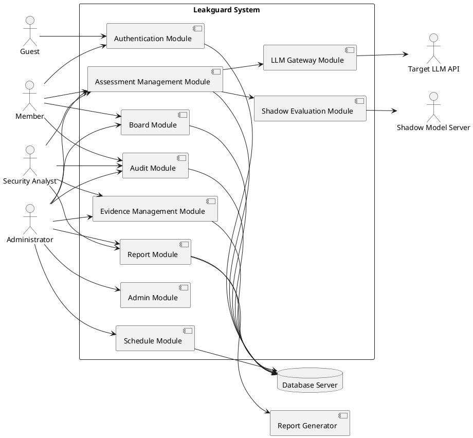
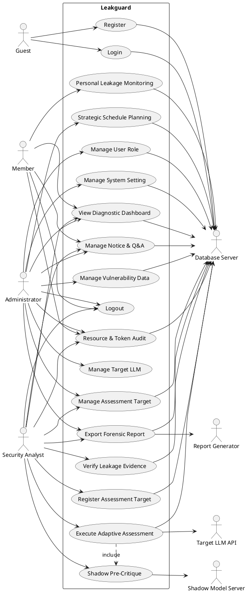
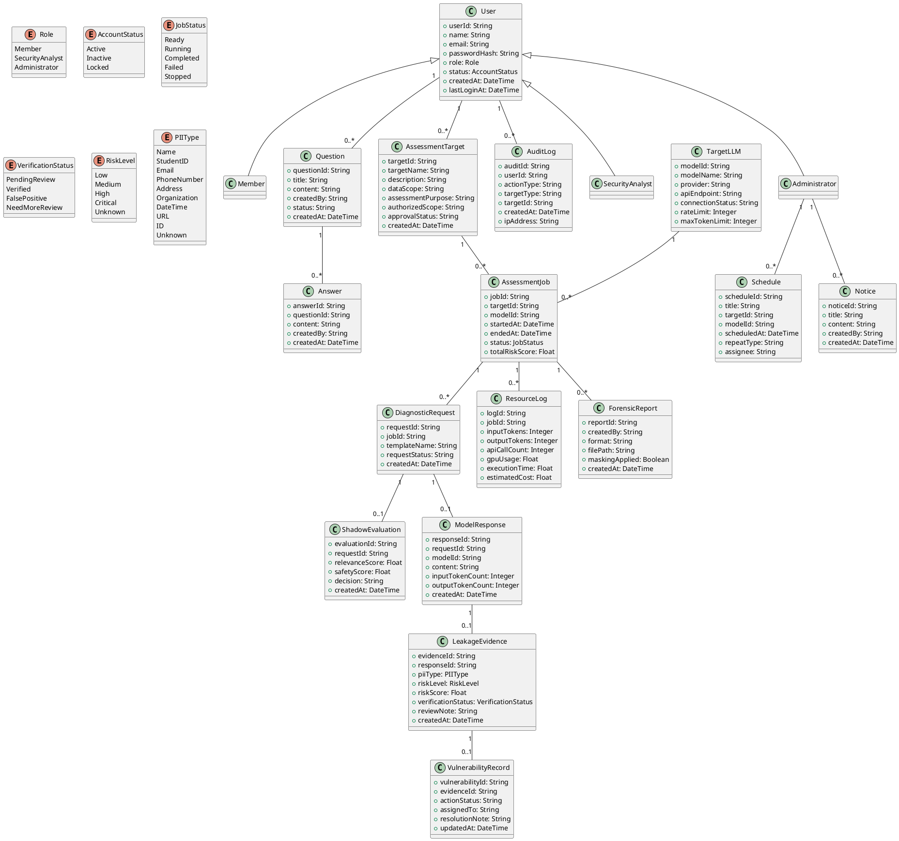

# Leakguard: LLM PII Leakage Diagnostic System
## 2. Analysis Document

---

## Student Info

| Item | Content |
|---|---|
| Student No. | 22313531 |
| Name | 전정웅 |
| E-Mail | jjy4260@yu.ac.kr |
| Project Name | Leakguard |
| Document Type | Conceptualization Document |
| System Type | LLM PII Leakage Diagnostic System |

---

## Revision History

| Revision Date | Version | Description | Author |
|---|---:|---|---|
| 2026.05.07 | 1.0.0 | Conceptualization 문서를 Analysis 문서로 변환 | 전정웅 |
| 2026.05.07 | 1.1.0 | Use case analysis, domain analysis, UI prototype 추가 | 전정웅 |
| 2026.05.08 | 1.2.0 | System context, application analysis, communication diagram 보완 | 전정웅 |
| 2026.05.08 | 1.3.0 | Data management, security requirements, acceptance criteria 추가 | 전정웅 |

---

## Contents

1. [Introduction](#1-introduction)
2. [System Context Analysis](#2-system-context-analysis)
3. [Use Case Analysis](#3-use-case-analysis)
4. [Domain Analysis](#4-domain-analysis)
5. [Application Analysis](#5-application-analysis)
6. [Data Management Analysis](#6-data-management-analysis)
7. [User Interface Prototype](#7-user-interface-prototype)
8. [Preliminary Use Manual](#8-preliminary-use-manual)
9. [Non-functional Requirements](#9-non-functional-requirements)
10. [Security and Privacy Requirements](#10-security-and-privacy-requirements)
11. [Acceptance Criteria](#11-acceptance-criteria)
12. [Glossary](#12-glossary)
13. [References](#13-references)

---

# 1. Introduction

## 1.1 Summary

본 문서는 Conceptualization 단계의 Leakguard 문서를 기반으로 작성한 Analysis 단계 문서다. Conceptualization 단계에서는 Leakguard가 왜 필요한지, 어떤 목적을 갖는지, 어떤 기능을 제공해야 하는지를 중심으로 설명하였다. 본 Analysis 문서에서는 그 요구사항을 바탕으로 시스템이 실제로 어떤 기능을 수행하는지 분석한다.

Leakguard는 LLM이 학습 또는 fine-tuning 과정에서 포함한 개인정보를 생성 응답으로 노출할 가능성을 진단하는 시스템이다. 사용자는 진단 대상 모델과 평가 범위를 등록하고, 관리자는 승인된 범위에서 보안 진단을 실행한다. 시스템은 Target LLM의 응답, Shadow Model의 보조 평가 결과, 자원 사용량, 유출 후보 데이터를 저장한다. 이후 보안 분석 담당자는 저장된 응답을 검토하여 실제 유출 가능성이 있는 데이터를 검증하고, 관리자는 이를 리포트로 출력할 수 있다.

본 문서는 Leakguard의 Use case, Domain model, Application structure, Communication flow, User Interface prototype을 분석하여 시스템 개발 단계에서 필요한 기준을 제공한다.

## 1.2 Background

최근 LLM은 문서 작성, 교육, 연구, 행정, 고객 응대, 보안 분석 등 다양한 분야에서 활용되고 있다. 그러나 LLM은 대규모 데이터를 기반으로 학습되기 때문에, 학습 데이터 안에 포함된 개인정보를 모델이 기억할 가능성이 존재한다. 이러한 개인정보가 사용자 질의에 대한 응답으로 재구성될 경우 법적, 윤리적, 보안적 문제가 발생할 수 있다.

기존 보안 점검 방식은 주로 정량적 위험도나 모델의 일반적인 안전성 평가에 집중한다. 그러나 실제 현장에서 필요한 것은 어떤 모델이 어떤 상황에서 어떤 종류의 개인정보를 노출할 수 있는지 관리 가능한 형태로 확인하는 것이다. Leakguard는 이러한 문제를 해결하기 위해 개인정보 유출 가능성을 진단하고, 진단 이력과 증거 데이터를 체계적으로 저장하며, 보안 감사에 필요한 보고서를 생성한다.

## 1.3 Business Goals

| Goal | Description |
|---|---|
| BG-01 | LLM 도입 전 개인정보 유출 가능성을 사전에 진단할 수 있어야 한다. |
| BG-02 | 진단 대상, 실행 이력, 유출 후보, 검증 결과를 하나의 시스템에서 관리할 수 있어야 한다. |
| BG-03 | 보안 담당자가 모델별 위험도를 쉽게 확인할 수 있어야 한다. |
| BG-04 | 유출 가능성이 있는 응답을 저장하고 검증하여 보안 감사 자료로 활용할 수 있어야 한다. |
| BG-05 | 진단 과정에서 사용된 API 토큰, GPU 자원, 실행 시간을 투명하게 관리해야 한다. |
| BG-06 | PDF 또는 Excel 형태의 Forensic Report를 생성할 수 있어야 한다. |
| BG-07 | 관리자, 보안 분석 담당자, 일반 사용자의 권한을 분리해야 한다. |
| BG-08 | 공지사항과 Q&A 기능을 통해 보안 점검 상태와 운영 정보를 공유할 수 있어야 한다. |
| BG-09 | 정기 점검 일정을 관리하여 모델 업데이트 이후 재진단이 가능해야 한다. |
| BG-10 | 개인정보 유출로 인한 법적·윤리적 리스크를 사전에 줄여야 한다. |

## 1.4 Technical Goals

| Goal | Description |
|---|---|
| TG-01 | Target LLM API와 안정적으로 통신할 수 있어야 한다. |
| TG-02 | Shadow Model Server와 통신하여 진단 요청과 응답을 보조 평가할 수 있어야 한다. |
| TG-03 | 진단 대상과 진단 작업을 고유 ID 기반으로 관리해야 한다. |
| TG-04 | 유출 후보 응답을 PII 유형, 위험도, 검증 상태별로 분류할 수 있어야 한다. |
| TG-05 | 모든 진단 이력과 유출 증거를 데이터베이스에 저장해야 한다. |
| TG-06 | 민감 데이터는 암호화 저장하고 권한에 따라 마스킹 처리해야 한다. |
| TG-07 | 진단 실행 중 오류가 발생해도 이전까지의 로그가 유실되지 않아야 한다. |
| TG-08 | 자원 사용량과 비용 추정치를 자동 계산해야 한다. |
| TG-09 | 관리자용 대시보드에서 전체 시스템 상태를 확인할 수 있어야 한다. |
| TG-10 | Windows와 Linux 환경에서 실행 가능해야 한다. |

## 1.5 Analysis Scope

본 문서에서 분석하는 시스템 범위는 다음과 같다.

- 사용자 회원가입 및 로그인
- 사용자 권한 관리
- 진단 대상 등록 및 관리
- Target LLM API 등록 및 연결 상태 관리
- Shadow Model 기반 사전 평가
- 승인된 보안 진단 실행
- Target LLM 응답 수집
- 유출 후보 탐지 및 저장
- 유출 후보 검증
- 취약점 데이터 관리
- API 토큰 및 GPU 자원 사용량 감사
- Forensic Report 생성
- 정기 점검 일정 관리
- 공지사항 및 Q&A 관리
- 관리자용 시스템 설정 관리

본 문서는 공격 프롬프트의 구체적인 생성 방법이나 우회 기법 자체를 설명하지 않는다. Leakguard는 승인된 환경에서 개인정보 유출 가능성을 진단하고 관리하는 보안 분석 시스템으로 한정한다.

## 1.6 Assumptions and Constraints

| Type | Description |
|---|---|
| Assumption | 사용자는 시스템 사용 전 계정을 등록해야 한다. |
| Assumption | Target LLM API는 관리자가 사전에 등록한다. |
| Assumption | 보안 진단은 승인된 데이터 범위 안에서만 실행된다. |
| Assumption | Shadow Model Server는 내부 네트워크 또는 로컬 환경에서 실행된다. |
| Constraint | 외부 LLM API의 응답 지연이나 장애가 발생할 수 있다. |
| Constraint | 복수 Shadow Model 사용 시 GPU 메모리 부족 문제가 발생할 수 있다. |
| Constraint | 개인정보 유출 후보는 반드시 권한 기반으로 열람되어야 한다. |
| Constraint | 모든 진단 로그는 삭제보다 보존을 우선한다. |
| Constraint | 보고서 출력 시 권한에 따라 민감 정보가 마스킹될 수 있다. |

---

# 2. System Context Analysis

## 2.1 System Context Description

Leakguard는 사용자, 관리자, 보안 분석 담당자, Target LLM API, Shadow Model Server, Database Server, Report Generator와 상호작용한다.

사용자는 시스템에 로그인한 뒤 권한에 맞는 기능을 사용한다. 일반 사용자는 본인과 관련된 진단 결과를 확인하고 공지사항이나 Q&A를 이용한다. 보안 분석 담당자는 진단 대상을 등록하고 승인된 진단 작업을 실행한다. 관리자는 사용자 권한, Target LLM 연결 정보, 취약점 데이터, 점검 일정, 공지사항을 관리한다.

Target LLM API는 실제 진단 대상 모델이다. Leakguard는 승인된 진단 요청을 Target LLM API로 전송하고 응답을 저장한다. Shadow Model Server는 Target LLM에 요청을 보내기 전 또는 응답을 받은 후 보조 평가를 수행한다. Database Server는 사용자, 진단 대상, 진단 이력, 유출 증거, 리포트 정보를 저장한다. Report Generator는 저장된 데이터를 기반으로 PDF 또는 Excel 보고서를 생성한다.

## 2.2 External Actor Description

| Actor | Description |
|---|---|
| Guest | 로그인하지 않은 사용자다. 회원가입과 로그인만 수행할 수 있다. |
| Member | 일반 사용자다. 본인이 접근 가능한 진단 결과와 공지사항, Q&A를 사용할 수 있다. |
| Security Analyst | 보안 진단 담당자다. 진단 대상 등록, 진단 실행, 유출 후보 검토를 수행한다. |
| Administrator | 전체 시스템 관리자다. 사용자, 모델, 취약점, 보고서, 일정, 게시판을 관리한다. |
| Target LLM API | 진단 대상이 되는 LLM API다. Leakguard의 승인된 요청에 대해 응답을 반환한다. |
| Shadow Model Server | 진단 요청과 응답의 유효성을 보조적으로 평가하는 내부 모델 서버다. |
| Database Server | 시스템의 주요 데이터를 저장하는 서버다. |
| Report Generator | 진단 결과를 PDF 또는 Excel로 생성하는 모듈이다. |

## 2.3 System Context Diagram



---

# 3. Use Case Analysis

## 3.1 Actor Description

| Actor | Available Functions |
|---|---|
| Guest | Register, Login |
| Member | View Dashboard, Monitor Personal Leakage, Resource Audit, Notice & Q&A, Logout |
| Security Analyst | Register Assessment Target, Execute Assessment, Verify Evidence, Export Report, Resource Audit |
| Administrator | Manage User Role, Manage Target LLM, Manage Vulnerability Data, Schedule Assessment, Manage Board, Export Report |
| Target LLM API | Receive authorized diagnostic request, Return model response |
| Shadow Model Server | Evaluate diagnostic request, Evaluate response reliability |
| Database Server | Store and retrieve user, target, job, evidence, audit, report, schedule data |
| Report Generator | Generate PDF / Excel report |

## 3.2 Use Case List

| Use Case ID | Use Case | Primary Actor | Description |
|---|---|---|---|
| UC-01 | Register | Guest | 사용자가 Leakguard의 기능을 사용하기 위해 회원가입한다. |
| UC-02 | Login | Guest | 등록된 사용자가 ID와 Password를 입력하여 시스템에 로그인한다. |
| UC-03 | Logout | Member / Security Analyst / Administrator | 로그인된 사용자가 시스템에서 로그아웃한다. |
| UC-04 | Manage User Role | Administrator | 관리자가 사용자 권한을 변경한다. |
| UC-05 | Register Assessment Target | Security Analyst | 보안 분석 담당자가 진단 대상과 평가 범위를 등록한다. |
| UC-06 | Manage Assessment Target | Security Analyst / Administrator | 등록된 진단 대상을 조회, 수정, 비활성화한다. |
| UC-07 | Manage Target LLM | Administrator | 관리자가 진단 대상 LLM API 정보를 등록하고 연결 상태를 관리한다. |
| UC-08 | Execute Adaptive Assessment | Security Analyst | 승인된 범위 안에서 LLM 개인정보 유출 진단을 실행한다. |
| UC-09 | Shadow Pre-Critique | System / Shadow Model Server | Target LLM 호출 전 Shadow Model이 진단 요청의 유효성을 사전 평가한다. |
| UC-10 | Personal Leakage Monitoring | Member | 일반 사용자가 본인과 관련된 개인정보 유출 위험도를 확인한다. |
| UC-11 | View Diagnostic Dashboard | Member / Security Analyst / Administrator | 진단 결과와 위험도 통계를 대시보드에서 확인한다. |
| UC-12 | Verify Leakage Evidence | Security Analyst | 보안 분석 담당자가 유출 후보 응답을 검토하고 검증 상태를 저장한다. |
| UC-13 | Manage Vulnerability Data | Administrator | 관리자가 검증된 취약점 데이터를 분류하고 조치 상태를 관리한다. |
| UC-14 | Resource & Token Audit | Member / Security Analyst / Administrator | 진단 과정에서 사용된 토큰, 비용, GPU, 실행 시간을 확인한다. |
| UC-15 | Export Forensic Report | Security Analyst / Administrator | 진단 결과와 유출 증거를 PDF 또는 Excel 보고서로 출력한다. |
| UC-16 | Strategic Schedule Planning | Administrator | 관리자가 모델 업데이트 주기나 연구실 정책에 맞춰 정기 점검 일정을 등록한다. |
| UC-17 | Manage Notice & Q&A | Member / Security Analyst / Administrator | 사용자가 공지사항을 확인하고 질문을 작성하며, 관리자는 답변을 등록한다. |
| UC-18 | Manage System Setting | Administrator | 관리자가 시스템 보안 설정, 저장 정책, API 제한값을 관리한다. |

## 3.3 Use Case Diagram



## 3.4 Use Case Description

## UC-01: Register

### General Characteristics

| Item | Description |
|---|---|
| Summary | 사용자가 Leakguard의 기능을 사용하기 위해 회원가입한다. |
| Scope | Leakguard System |
| Level | Analysis Level |
| Status | Analysis |
| Primary Actor | Guest |
| Preconditions | 사용자가 필요한 권한을 가지고 있어야 하며, 시스템이 정상 실행 중이어야 한다. |
| Trigger | 사용자가 `Register` 기능을 실행한다. |
| Success Post Condition | 기능 수행 결과가 시스템에 반영되고 필요한 이력이 저장된다. |
| Failed Post Condition | 기능 수행이 중단되고 실패 메시지 또는 실패 로그가 저장된다. |

### Main Success Scenario

| Step | Action |
|---:|---|
| 1 | 사용자가 Register 버튼을 클릭한다. |
| 2 | 시스템은 회원가입 화면을 출력한다. |
| 3 | 사용자는 ID, Password, 이름, 이메일, 소속을 입력한다. |
| 4 | 시스템은 입력값 형식과 중복 여부를 검사한다. |
| 5 | 시스템은 비밀번호를 hash 처리한다. |
| 6 | 사용자 정보를 데이터베이스에 저장한다. |
| 7 | 회원가입 성공 메시지를 출력한다. |

### Extension Scenarios

| Step | Branching Action |
|---|---|
| 1a | 필수 입력값이 누락되면 누락 항목을 표시한다. |
| 2a | ID 또는 이메일이 중복되면 중복 메시지를 출력한다. |
| 3a | DB 저장 실패 시 회원가입 실패 메시지를 출력한다. |

### Related Information

| Item | Description |
|---|---|
| Performance | 일반 조회 및 저장 작업은 1~3 seconds 이내 수행 |
| Frequency | 사용자 또는 관리자 필요 시 |
| Concurrency | 권한 및 시스템 정책에 따라 제한 |
| Security | 권한 확인 및 Audit Log 저장 |


## UC-02: Login

### General Characteristics

| Item | Description |
|---|---|
| Summary | 등록된 사용자가 ID와 Password를 입력하여 시스템에 로그인한다. |
| Scope | Leakguard System |
| Level | Analysis Level |
| Status | Analysis |
| Primary Actor | Guest |
| Preconditions | 사용자가 필요한 권한을 가지고 있어야 하며, 시스템이 정상 실행 중이어야 한다. |
| Trigger | 사용자가 `Login` 기능을 실행한다. |
| Success Post Condition | 기능 수행 결과가 시스템에 반영되고 필요한 이력이 저장된다. |
| Failed Post Condition | 기능 수행이 중단되고 실패 메시지 또는 실패 로그가 저장된다. |

### Main Success Scenario

| Step | Action |
|---:|---|
| 1 | 사용자가 ID와 Password를 입력한다. |
| 2 | 시스템은 사용자 정보를 조회한다. |
| 3 | Password hash를 비교한다. |
| 4 | 계정 상태와 권한을 확인한다. |
| 5 | 세션을 생성한다. |
| 6 | 권한에 맞는 Dashboard를 출력한다. |

### Extension Scenarios

| Step | Branching Action |
|---|---|
| 1a | ID가 없거나 Password가 일치하지 않으면 실패 메시지를 출력한다. |
| 2a | 계정이 비활성화되어 있으면 관리자 문의 메시지를 출력한다. |
| 3a | 세션 생성 실패 시 다시 로그인하도록 안내한다. |

### Related Information

| Item | Description |
|---|---|
| Performance | 일반 조회 및 저장 작업은 1~3 seconds 이내 수행 |
| Frequency | 사용자 또는 관리자 필요 시 |
| Concurrency | 권한 및 시스템 정책에 따라 제한 |
| Security | 권한 확인 및 Audit Log 저장 |


## UC-03: Logout

### General Characteristics

| Item | Description |
|---|---|
| Summary | 로그인된 사용자가 시스템에서 로그아웃한다. |
| Scope | Leakguard System |
| Level | Analysis Level |
| Status | Analysis |
| Primary Actor | Member / Security Analyst / Administrator |
| Preconditions | 사용자가 필요한 권한을 가지고 있어야 하며, 시스템이 정상 실행 중이어야 한다. |
| Trigger | 사용자가 `Logout` 기능을 실행한다. |
| Success Post Condition | 기능 수행 결과가 시스템에 반영되고 필요한 이력이 저장된다. |
| Failed Post Condition | 기능 수행이 중단되고 실패 메시지 또는 실패 로그가 저장된다. |

### Main Success Scenario

| Step | Action |
|---:|---|
| 1 | 사용자가 Logout 버튼을 클릭한다. |
| 2 | 시스템은 현재 세션을 확인한다. |
| 3 | 세션을 만료 처리한다. |
| 4 | 로그인 화면으로 이동한다. |

### Extension Scenarios

| Step | Branching Action |
|---|---|
| 1a | 이미 세션이 만료된 경우 로그인 화면으로 이동한다. |
| 2a | 세션 삭제 실패 시 로그아웃 실패 메시지를 출력한다. |

### Related Information

| Item | Description |
|---|---|
| Performance | 일반 조회 및 저장 작업은 1~3 seconds 이내 수행 |
| Frequency | 사용자 또는 관리자 필요 시 |
| Concurrency | 권한 및 시스템 정책에 따라 제한 |
| Security | 권한 확인 및 Audit Log 저장 |


## UC-04: Manage User Role

### General Characteristics

| Item | Description |
|---|---|
| Summary | 관리자가 사용자 권한을 변경한다. |
| Scope | Leakguard System |
| Level | Analysis Level |
| Status | Analysis |
| Primary Actor | Administrator |
| Preconditions | 사용자가 필요한 권한을 가지고 있어야 하며, 시스템이 정상 실행 중이어야 한다. |
| Trigger | 사용자가 `Manage User Role` 기능을 실행한다. |
| Success Post Condition | 기능 수행 결과가 시스템에 반영되고 필요한 이력이 저장된다. |
| Failed Post Condition | 기능 수행이 중단되고 실패 메시지 또는 실패 로그가 저장된다. |

### Main Success Scenario

| Step | Action |
|---:|---|
| 1 | 관리자가 User Management 메뉴를 클릭한다. |
| 2 | 시스템은 사용자 목록을 출력한다. |
| 3 | 관리자는 특정 사용자를 선택한다. |
| 4 | Member, Security Analyst, Administrator 중 권한을 선택한다. |
| 5 | 시스템은 변경된 권한을 저장한다. |
| 6 | 권한 변경 이력을 Audit Log에 저장한다. |

### Extension Scenarios

| Step | Branching Action |
|---|---|
| 1a | 사용자 목록 조회 실패 시 오류 메시지를 출력한다. |
| 2a | 자기 자신의 관리자 권한 제거 시 경고한다. |
| 3a | Audit Log 저장 실패 시 권한 변경을 취소한다. |

### Related Information

| Item | Description |
|---|---|
| Performance | 일반 조회 및 저장 작업은 1~3 seconds 이내 수행 |
| Frequency | 사용자 또는 관리자 필요 시 |
| Concurrency | 권한 및 시스템 정책에 따라 제한 |
| Security | 권한 확인 및 Audit Log 저장 |


## UC-05: Register Assessment Target

### General Characteristics

| Item | Description |
|---|---|
| Summary | 보안 분석 담당자가 진단 대상과 평가 범위를 등록한다. |
| Scope | Leakguard System |
| Level | Analysis Level |
| Status | Analysis |
| Primary Actor | Security Analyst |
| Preconditions | 사용자가 필요한 권한을 가지고 있어야 하며, 시스템이 정상 실행 중이어야 한다. |
| Trigger | 사용자가 `Register Assessment Target` 기능을 실행한다. |
| Success Post Condition | 기능 수행 결과가 시스템에 반영되고 필요한 이력이 저장된다. |
| Failed Post Condition | 기능 수행이 중단되고 실패 메시지 또는 실패 로그가 저장된다. |

### Main Success Scenario

| Step | Action |
|---:|---|
| 1 | Assessment Target Register 메뉴를 클릭한다. |
| 2 | Target Name, Description, Data Scope, Assessment Purpose를 입력한다. |
| 3 | Authorized Scope를 선택한다. |
| 4 | 시스템은 필수값과 중복 여부를 검사한다. |
| 5 | Target ID를 생성한다. |
| 6 | 진단 대상 정보를 저장한다. |

### Extension Scenarios

| Step | Branching Action |
|---|---|
| 1a | 필수값 누락 시 저장을 차단한다. |
| 2a | 동일 Target Name이 있으면 중복 경고를 출력한다. |
| 3a | DB 저장 실패 시 등록 실패 메시지를 출력한다. |

### Related Information

| Item | Description |
|---|---|
| Performance | 일반 조회 및 저장 작업은 1~3 seconds 이내 수행 |
| Frequency | 사용자 또는 관리자 필요 시 |
| Concurrency | 권한 및 시스템 정책에 따라 제한 |
| Security | 권한 확인 및 Audit Log 저장 |


## UC-06: Manage Assessment Target

### General Characteristics

| Item | Description |
|---|---|
| Summary | 등록된 진단 대상을 조회, 수정, 비활성화한다. |
| Scope | Leakguard System |
| Level | Analysis Level |
| Status | Analysis |
| Primary Actor | Security Analyst / Administrator |
| Preconditions | 사용자가 필요한 권한을 가지고 있어야 하며, 시스템이 정상 실행 중이어야 한다. |
| Trigger | 사용자가 `Manage Assessment Target` 기능을 실행한다. |
| Success Post Condition | 기능 수행 결과가 시스템에 반영되고 필요한 이력이 저장된다. |
| Failed Post Condition | 기능 수행이 중단되고 실패 메시지 또는 실패 로그가 저장된다. |

### Main Success Scenario

| Step | Action |
|---:|---|
| 1 | Assessment Target List 메뉴를 클릭한다. |
| 2 | 시스템은 권한을 확인한다. |
| 3 | 조회 가능한 대상 목록을 출력한다. |
| 4 | 사용자는 특정 대상을 선택한다. |
| 5 | 필요한 내용을 수정한다. |
| 6 | 변경 내용을 저장하고 Audit Log에 기록한다. |

### Extension Scenarios

| Step | Branching Action |
|---|---|
| 1a | 조회 가능한 대상이 없으면 빈 목록을 출력한다. |
| 2a | 실행 중인 진단 대상은 핵심 정보 수정을 제한한다. |
| 3a | 저장 실패 시 변경 이전 상태로 되돌린다. |

### Related Information

| Item | Description |
|---|---|
| Performance | 일반 조회 및 저장 작업은 1~3 seconds 이내 수행 |
| Frequency | 사용자 또는 관리자 필요 시 |
| Concurrency | 권한 및 시스템 정책에 따라 제한 |
| Security | 권한 확인 및 Audit Log 저장 |


## UC-07: Manage Target LLM

### General Characteristics

| Item | Description |
|---|---|
| Summary | 관리자가 진단 대상 LLM API 정보를 등록하고 연결 상태를 관리한다. |
| Scope | Leakguard System |
| Level | Analysis Level |
| Status | Analysis |
| Primary Actor | Administrator |
| Preconditions | 사용자가 필요한 권한을 가지고 있어야 하며, 시스템이 정상 실행 중이어야 한다. |
| Trigger | 사용자가 `Manage Target LLM` 기능을 실행한다. |
| Success Post Condition | 기능 수행 결과가 시스템에 반영되고 필요한 이력이 저장된다. |
| Failed Post Condition | 기능 수행이 중단되고 실패 메시지 또는 실패 로그가 저장된다. |

### Main Success Scenario

| Step | Action |
|---:|---|
| 1 | 관리자가 Target LLM Management 메뉴를 클릭한다. |
| 2 | Model Name, Provider, API Endpoint, API Key를 입력한다. |
| 3 | Rate Limit과 Max Token Limit을 입력한다. |
| 4 | Connection Test를 실행한다. |
| 5 | 연결 성공 시 모델 정보를 저장한다. |
| 6 | 모델 상태를 Available로 표시한다. |

### Extension Scenarios

| Step | Branching Action |
|---|---|
| 1a | Endpoint 형식이 잘못되면 오류 메시지를 출력한다. |
| 2a | API 인증 실패 시 저장하지 않는다. |
| 3a | Timeout 발생 시 Timeout 상태로 표시한다. |

### Related Information

| Item | Description |
|---|---|
| Performance | 일반 조회 및 저장 작업은 1~3 seconds 이내 수행 |
| Frequency | 사용자 또는 관리자 필요 시 |
| Concurrency | 권한 및 시스템 정책에 따라 제한 |
| Security | 권한 확인 및 Audit Log 저장 |


## UC-08: Execute Adaptive Assessment

### General Characteristics

| Item | Description |
|---|---|
| Summary | 승인된 범위 안에서 LLM 개인정보 유출 진단을 실행한다. |
| Scope | Leakguard System |
| Level | Analysis Level |
| Status | Analysis |
| Primary Actor | Security Analyst |
| Preconditions | 사용자가 필요한 권한을 가지고 있어야 하며, 시스템이 정상 실행 중이어야 한다. |
| Trigger | 사용자가 `Execute Adaptive Assessment` 기능을 실행한다. |
| Success Post Condition | 기능 수행 결과가 시스템에 반영되고 필요한 이력이 저장된다. |
| Failed Post Condition | 기능 수행이 중단되고 실패 메시지 또는 실패 로그가 저장된다. |

### Main Success Scenario

| Step | Action |
|---:|---|
| 1 | Assessment Target과 Target LLM을 선택한다. |
| 2 | Diagnostic Template, Max Query Count, Token Limit을 설정한다. |
| 3 | 시스템은 사용자 권한과 Authorized Scope를 확인한다. |
| 4 | Shadow Pre-Critique를 수행한다. |
| 5 | 승인된 요청만 Target LLM API에 전송한다. |
| 6 | 응답, 실행 시간, 토큰 사용량을 저장한다. |
| 7 | 위험도를 계산하고 Evidence Candidate를 저장한다. |

### Extension Scenarios

| Step | Branching Action |
|---|---|
| 1a | 권한 부족 시 실행을 차단한다. |
| 2a | Authorized Scope 밖의 요청은 실행하지 않는다. |
| 3a | Target API 실패 시 재시도 후 실패 로그를 저장한다. |
| 4a | 저장 실패 시 로컬 임시 로그에 저장한다. |

### Related Information

| Item | Description |
|---|---|
| Performance | 일반 조회 및 저장 작업은 1~3 seconds 이내 수행 |
| Frequency | 사용자 또는 관리자 필요 시 |
| Concurrency | 권한 및 시스템 정책에 따라 제한 |
| Security | 권한 확인 및 Audit Log 저장 |


## UC-09: Shadow Pre-Critique

### General Characteristics

| Item | Description |
|---|---|
| Summary | Target LLM 호출 전 Shadow Model이 진단 요청의 유효성을 사전 평가한다. |
| Scope | Leakguard System |
| Level | Analysis Level |
| Status | Analysis |
| Primary Actor | System / Shadow Model Server |
| Preconditions | 사용자가 필요한 권한을 가지고 있어야 하며, 시스템이 정상 실행 중이어야 한다. |
| Trigger | 사용자가 `Shadow Pre-Critique` 기능을 실행한다. |
| Success Post Condition | 기능 수행 결과가 시스템에 반영되고 필요한 이력이 저장된다. |
| Failed Post Condition | 기능 수행이 중단되고 실패 메시지 또는 실패 로그가 저장된다. |

### Main Success Scenario

| Step | Action |
|---:|---|
| 1 | 시스템이 진단 요청 후보를 생성한다. |
| 2 | Shadow Model Server에 평가 요청을 보낸다. |
| 3 | Shadow Model은 관련성, 안전성, 평가 가능성을 분석한다. |
| 4 | Approved, Hold, Rejected로 분류한다. |
| 5 | Approved 요청만 Target LLM 실행 후보에 포함한다. |
| 6 | 평가 결과를 Audit Log에 저장한다. |

### Extension Scenarios

| Step | Branching Action |
|---|---|
| 1a | Shadow 서버가 응답하지 않으면 Hold 처리한다. |
| 2a | 평가 결과가 비정상 형식이면 Hold 처리한다. |
| 3a | Rejected 요청은 Target LLM으로 전송하지 않는다. |

### Related Information

| Item | Description |
|---|---|
| Performance | 일반 조회 및 저장 작업은 1~3 seconds 이내 수행 |
| Frequency | 사용자 또는 관리자 필요 시 |
| Concurrency | 권한 및 시스템 정책에 따라 제한 |
| Security | 권한 확인 및 Audit Log 저장 |


## UC-10: Personal Leakage Monitoring

### General Characteristics

| Item | Description |
|---|---|
| Summary | 일반 사용자가 본인과 관련된 개인정보 유출 위험도를 확인한다. |
| Scope | Leakguard System |
| Level | Analysis Level |
| Status | Analysis |
| Primary Actor | Member |
| Preconditions | 사용자가 필요한 권한을 가지고 있어야 하며, 시스템이 정상 실행 중이어야 한다. |
| Trigger | 사용자가 `Personal Leakage Monitoring` 기능을 실행한다. |
| Success Post Condition | 기능 수행 결과가 시스템에 반영되고 필요한 이력이 저장된다. |
| Failed Post Condition | 기능 수행이 중단되고 실패 메시지 또는 실패 로그가 저장된다. |

### Main Success Scenario

| Step | Action |
|---:|---|
| 1 | 사용자가 Personal Monitoring 메뉴를 클릭한다. |
| 2 | 시스템은 사용자 ID와 권한을 확인한다. |
| 3 | 사용자와 연결된 Assessment Target을 조회한다. |
| 4 | 진단 결과와 위험도 요약을 불러온다. |
| 5 | 민감 응답 원문을 권한에 따라 마스킹한다. |
| 6 | 모니터링 화면을 출력한다. |

### Extension Scenarios

| Step | Branching Action |
|---|---|
| 1a | 연결된 진단 대상이 없으면 빈 화면을 출력한다. |
| 2a | 진단 결과가 없으면 No assessment result 메시지를 출력한다. |
| 3a | 권한이 없으면 상세 응답을 비공개 처리한다. |

### Related Information

| Item | Description |
|---|---|
| Performance | 일반 조회 및 저장 작업은 1~3 seconds 이내 수행 |
| Frequency | 사용자 또는 관리자 필요 시 |
| Concurrency | 권한 및 시스템 정책에 따라 제한 |
| Security | 권한 확인 및 Audit Log 저장 |


## UC-11: View Diagnostic Dashboard

### General Characteristics

| Item | Description |
|---|---|
| Summary | 진단 결과와 위험도 통계를 대시보드에서 확인한다. |
| Scope | Leakguard System |
| Level | Analysis Level |
| Status | Analysis |
| Primary Actor | Member / Security Analyst / Administrator |
| Preconditions | 사용자가 필요한 권한을 가지고 있어야 하며, 시스템이 정상 실행 중이어야 한다. |
| Trigger | 사용자가 `View Diagnostic Dashboard` 기능을 실행한다. |
| Success Post Condition | 기능 수행 결과가 시스템에 반영되고 필요한 이력이 저장된다. |
| Failed Post Condition | 기능 수행이 중단되고 실패 메시지 또는 실패 로그가 저장된다. |

### Main Success Scenario

| Step | Action |
|---:|---|
| 1 | Dashboard 메뉴를 클릭한다. |
| 2 | 시스템은 사용자 권한을 확인한다. |
| 3 | 조회 가능한 진단 작업을 불러온다. |
| 4 | 총 진단 수, 유출 후보 수, 검증 완료 수를 계산한다. |
| 5 | PII 유형별 및 모델별 위험도 분포를 계산한다. |
| 6 | 그래프와 테이블로 출력한다. |

### Extension Scenarios

| Step | Branching Action |
|---|---|
| 1a | 조회 가능한 데이터가 없으면 빈 대시보드를 출력한다. |
| 2a | DB 연결 실패 시 오류 메시지를 출력한다. |
| 3a | 그래프 생성 실패 시 테이블만 출력한다. |

### Related Information

| Item | Description |
|---|---|
| Performance | 일반 조회 및 저장 작업은 1~3 seconds 이내 수행 |
| Frequency | 사용자 또는 관리자 필요 시 |
| Concurrency | 권한 및 시스템 정책에 따라 제한 |
| Security | 권한 확인 및 Audit Log 저장 |


## UC-12: Verify Leakage Evidence

### General Characteristics

| Item | Description |
|---|---|
| Summary | 보안 분석 담당자가 유출 후보 응답을 검토하고 검증 상태를 저장한다. |
| Scope | Leakguard System |
| Level | Analysis Level |
| Status | Analysis |
| Primary Actor | Security Analyst |
| Preconditions | 사용자가 필요한 권한을 가지고 있어야 하며, 시스템이 정상 실행 중이어야 한다. |
| Trigger | 사용자가 `Verify Leakage Evidence` 기능을 실행한다. |
| Success Post Condition | 기능 수행 결과가 시스템에 반영되고 필요한 이력이 저장된다. |
| Failed Post Condition | 기능 수행이 중단되고 실패 메시지 또는 실패 로그가 저장된다. |

### Main Success Scenario

| Step | Action |
|---:|---|
| 1 | Evidence Verification 메뉴를 클릭한다. |
| 2 | Pending Review 후보 목록을 출력한다. |
| 3 | 분석 담당자가 특정 Evidence를 선택한다. |
| 4 | 원본 응답, 모델명, 실행 시간, 위험도, 로그를 확인한다. |
| 5 | Verification Status와 Review Note를 입력한다. |
| 6 | 검증 상태와 메모를 저장하고 Audit Log에 기록한다. |

### Extension Scenarios

| Step | Branching Action |
|---|---|
| 1a | 검토 후보가 없으면 빈 목록을 출력한다. |
| 2a | 판단이 어려운 경우 Need More Review로 저장한다. |
| 3a | 저장 실패 시 기존 상태를 유지한다. |

### Related Information

| Item | Description |
|---|---|
| Performance | 일반 조회 및 저장 작업은 1~3 seconds 이내 수행 |
| Frequency | 사용자 또는 관리자 필요 시 |
| Concurrency | 권한 및 시스템 정책에 따라 제한 |
| Security | 권한 확인 및 Audit Log 저장 |


## UC-13: Manage Vulnerability Data

### General Characteristics

| Item | Description |
|---|---|
| Summary | 관리자가 검증된 취약점 데이터를 분류하고 조치 상태를 관리한다. |
| Scope | Leakguard System |
| Level | Analysis Level |
| Status | Analysis |
| Primary Actor | Administrator |
| Preconditions | 사용자가 필요한 권한을 가지고 있어야 하며, 시스템이 정상 실행 중이어야 한다. |
| Trigger | 사용자가 `Manage Vulnerability Data` 기능을 실행한다. |
| Success Post Condition | 기능 수행 결과가 시스템에 반영되고 필요한 이력이 저장된다. |
| Failed Post Condition | 기능 수행이 중단되고 실패 메시지 또는 실패 로그가 저장된다. |

### Main Success Scenario

| Step | Action |
|---:|---|
| 1 | Vulnerability Management 메뉴를 클릭한다. |
| 2 | Verified Evidence 목록을 출력한다. |
| 3 | 특정 항목을 선택한다. |
| 4 | PII Type, Risk Level, Action Status를 지정한다. |
| 5 | 담당자와 조치 메모를 입력한다. |
| 6 | 변경 내용을 저장하고 Audit Log에 기록한다. |

### Extension Scenarios

| Step | Branching Action |
|---|---|
| 1a | Verified Evidence가 없으면 빈 목록을 출력한다. |
| 2a | PII Type 미선택 시 저장을 차단한다. |
| 3a | 저장 실패 시 오류 메시지를 출력한다. |

### Related Information

| Item | Description |
|---|---|
| Performance | 일반 조회 및 저장 작업은 1~3 seconds 이내 수행 |
| Frequency | 사용자 또는 관리자 필요 시 |
| Concurrency | 권한 및 시스템 정책에 따라 제한 |
| Security | 권한 확인 및 Audit Log 저장 |


## UC-14: Resource & Token Audit

### General Characteristics

| Item | Description |
|---|---|
| Summary | 진단 과정에서 사용된 토큰, 비용, GPU, 실행 시간을 확인한다. |
| Scope | Leakguard System |
| Level | Analysis Level |
| Status | Analysis |
| Primary Actor | Member / Security Analyst / Administrator |
| Preconditions | 사용자가 필요한 권한을 가지고 있어야 하며, 시스템이 정상 실행 중이어야 한다. |
| Trigger | 사용자가 `Resource & Token Audit` 기능을 실행한다. |
| Success Post Condition | 기능 수행 결과가 시스템에 반영되고 필요한 이력이 저장된다. |
| Failed Post Condition | 기능 수행이 중단되고 실패 메시지 또는 실패 로그가 저장된다. |

### Main Success Scenario

| Step | Action |
|---:|---|
| 1 | Resource & Token Audit 메뉴를 클릭한다. |
| 2 | 시스템은 권한을 확인한다. |
| 3 | 조회 가능한 실행 로그를 불러온다. |
| 4 | 입력 토큰, 출력 토큰, API 호출 수, 예상 비용을 계산한다. |
| 5 | GPU 사용량과 실행 시간을 계산한다. |
| 6 | 기간별, 모델별, 사용자별 통계를 출력한다. |

### Extension Scenarios

| Step | Branching Action |
|---|---|
| 1a | 로그가 없으면 빈 화면을 출력한다. |
| 2a | 토큰 정보가 없으면 Unknown으로 표시한다. |
| 3a | GPU 정보가 없으면 N/A로 표시한다. |

### Related Information

| Item | Description |
|---|---|
| Performance | 일반 조회 및 저장 작업은 1~3 seconds 이내 수행 |
| Frequency | 사용자 또는 관리자 필요 시 |
| Concurrency | 권한 및 시스템 정책에 따라 제한 |
| Security | 권한 확인 및 Audit Log 저장 |


## UC-15: Export Forensic Report

### General Characteristics

| Item | Description |
|---|---|
| Summary | 진단 결과와 유출 증거를 PDF 또는 Excel 보고서로 출력한다. |
| Scope | Leakguard System |
| Level | Analysis Level |
| Status | Analysis |
| Primary Actor | Security Analyst / Administrator |
| Preconditions | 사용자가 필요한 권한을 가지고 있어야 하며, 시스템이 정상 실행 중이어야 한다. |
| Trigger | 사용자가 `Export Forensic Report` 기능을 실행한다. |
| Success Post Condition | 기능 수행 결과가 시스템에 반영되고 필요한 이력이 저장된다. |
| Failed Post Condition | 기능 수행이 중단되고 실패 메시지 또는 실패 로그가 저장된다. |

### Main Success Scenario

| Step | Action |
|---:|---|
| 1 | Report Export 메뉴를 클릭한다. |
| 2 | 기간, Target LLM, Assessment Target, Risk Level을 선택한다. |
| 3 | PDF 또는 Excel 형식을 선택한다. |
| 4 | 시스템은 출력 권한을 확인한다. |
| 5 | 조건에 맞는 진단 결과와 유출 증거를 조회한다. |
| 6 | 권한에 따라 마스킹한다. |
| 7 | Report Generator가 파일을 생성한다. |
| 8 | 다운로드 링크를 출력한다. |

### Extension Scenarios

| Step | Branching Action |
|---|---|
| 1a | 권한 부족 시 보고서 생성을 차단한다. |
| 2a | 조건에 맞는 데이터가 없으면 생성 불가 메시지를 출력한다. |
| 3a | 파일 생성 실패 시 오류 메시지를 출력한다. |

### Related Information

| Item | Description |
|---|---|
| Performance | 일반 조회 및 저장 작업은 1~3 seconds 이내 수행 |
| Frequency | 사용자 또는 관리자 필요 시 |
| Concurrency | 권한 및 시스템 정책에 따라 제한 |
| Security | 권한 확인 및 Audit Log 저장 |


## UC-16: Strategic Schedule Planning

### General Characteristics

| Item | Description |
|---|---|
| Summary | 관리자가 모델 업데이트 주기나 연구실 정책에 맞춰 정기 점검 일정을 등록한다. |
| Scope | Leakguard System |
| Level | Analysis Level |
| Status | Analysis |
| Primary Actor | Administrator |
| Preconditions | 사용자가 필요한 권한을 가지고 있어야 하며, 시스템이 정상 실행 중이어야 한다. |
| Trigger | 사용자가 `Strategic Schedule Planning` 기능을 실행한다. |
| Success Post Condition | 기능 수행 결과가 시스템에 반영되고 필요한 이력이 저장된다. |
| Failed Post Condition | 기능 수행이 중단되고 실패 메시지 또는 실패 로그가 저장된다. |

### Main Success Scenario

| Step | Action |
|---:|---|
| 1 | Schedule Planning 메뉴를 클릭한다. |
| 2 | 달력 화면을 출력한다. |
| 3 | 점검 날짜, 시간, Assessment Target, Target LLM을 선택한다. |
| 4 | 담당자, 반복 여부, 알림 여부를 설정한다. |
| 5 | 일정 충돌 여부를 확인한다. |
| 6 | 일정을 저장하고 사용자에게 표시한다. |

### Extension Scenarios

| Step | Branching Action |
|---|---|
| 1a | 중복 일정이 있으면 경고 메시지를 출력한다. |
| 2a | 담당자가 없으면 재입력을 요청한다. |
| 3a | 저장 실패 시 등록 실패 메시지를 출력한다. |

### Related Information

| Item | Description |
|---|---|
| Performance | 일반 조회 및 저장 작업은 1~3 seconds 이내 수행 |
| Frequency | 사용자 또는 관리자 필요 시 |
| Concurrency | 권한 및 시스템 정책에 따라 제한 |
| Security | 권한 확인 및 Audit Log 저장 |


## UC-17: Manage Notice & Q&A

### General Characteristics

| Item | Description |
|---|---|
| Summary | 사용자가 공지사항을 확인하고 질문을 작성하며, 관리자는 답변을 등록한다. |
| Scope | Leakguard System |
| Level | Analysis Level |
| Status | Analysis |
| Primary Actor | Member / Security Analyst / Administrator |
| Preconditions | 사용자가 필요한 권한을 가지고 있어야 하며, 시스템이 정상 실행 중이어야 한다. |
| Trigger | 사용자가 `Manage Notice & Q&A` 기능을 실행한다. |
| Success Post Condition | 기능 수행 결과가 시스템에 반영되고 필요한 이력이 저장된다. |
| Failed Post Condition | 기능 수행이 중단되고 실패 메시지 또는 실패 로그가 저장된다. |

### Main Success Scenario

| Step | Action |
|---:|---|
| 1 | Notice & Q&A 메뉴를 클릭한다. |
| 2 | Notice 탭과 Q&A 탭을 출력한다. |
| 3 | 사용자는 게시글 목록과 상세 내용을 확인한다. |
| 4 | 사용자는 질문을 작성할 수 있다. |
| 5 | 관리자는 공지사항 또는 답변을 작성한다. |
| 6 | 게시글 정보를 저장한다. |

### Extension Scenarios

| Step | Branching Action |
|---|---|
| 1a | 게시글이 없으면 빈 목록을 출력한다. |
| 2a | 일반 사용자가 공지사항을 작성하려 하면 권한 오류를 출력한다. |
| 3a | 저장 실패 시 오류 메시지를 출력한다. |

### Related Information

| Item | Description |
|---|---|
| Performance | 일반 조회 및 저장 작업은 1~3 seconds 이내 수행 |
| Frequency | 사용자 또는 관리자 필요 시 |
| Concurrency | 권한 및 시스템 정책에 따라 제한 |
| Security | 권한 확인 및 Audit Log 저장 |


## UC-18: Manage System Setting

### General Characteristics

| Item | Description |
|---|---|
| Summary | 관리자가 시스템 보안 설정, 저장 정책, API 제한값을 관리한다. |
| Scope | Leakguard System |
| Level | Analysis Level |
| Status | Analysis |
| Primary Actor | Administrator |
| Preconditions | 사용자가 필요한 권한을 가지고 있어야 하며, 시스템이 정상 실행 중이어야 한다. |
| Trigger | 사용자가 `Manage System Setting` 기능을 실행한다. |
| Success Post Condition | 기능 수행 결과가 시스템에 반영되고 필요한 이력이 저장된다. |
| Failed Post Condition | 기능 수행이 중단되고 실패 메시지 또는 실패 로그가 저장된다. |

### Main Success Scenario

| Step | Action |
|---:|---|
| 1 | System Setting 메뉴를 클릭한다. |
| 2 | 현재 설정값을 출력한다. |
| 3 | Session Timeout, API Rate Limit, Evidence Retention Period를 설정한다. |
| 4 | Report Masking Policy를 설정한다. |
| 5 | 설정값을 저장한다. |
| 6 | 설정 변경 이력을 Audit Log에 저장한다. |

### Extension Scenarios

| Step | Branching Action |
|---|---|
| 1a | Rate Limit 값이 허용 범위를 벗어나면 저장을 차단한다. |
| 2a | 보존 기간이 정책보다 짧으면 경고한다. |
| 3a | 저장 실패 시 기존 설정을 유지한다. |

### Related Information

| Item | Description |
|---|---|
| Performance | 일반 조회 및 저장 작업은 1~3 seconds 이내 수행 |
| Frequency | 사용자 또는 관리자 필요 시 |
| Concurrency | 권한 및 시스템 정책에 따라 제한 |
| Security | 권한 확인 및 Audit Log 저장 |


---

# 4. Domain Analysis

## 4.1 Domain Overview

Leakguard의 도메인은 사용자 관리 영역, 진단 대상 관리 영역, LLM 진단 실행 영역, 유출 증거 관리 영역, 감사 로그 영역, 보고서 영역, 일정 및 게시판 영역으로 구성된다.

핵심 도메인 객체는 User, AssessmentTarget, TargetLLM, AssessmentJob, DiagnosticRequest, ModelResponse, LeakageEvidence, ResourceLog, ForensicReport다. User는 시스템을 사용하는 사람이며 권한에 따라 Member, SecurityAnalyst, Administrator로 구분된다. AssessmentTarget은 보안 진단 대상이고, TargetLLM은 진단 요청을 받을 모델이다. AssessmentJob은 하나의 진단 실행 단위다. DiagnosticRequest와 ModelResponse는 진단 과정에서 생성되는 요청과 응답이다. LeakageEvidence는 개인정보 유출 가능성이 있는 응답을 의미한다.

## 4.2 Domain Class Diagram



## 4.3 Domain Class Description

| Class | Description |
|---|---|
| User | Leakguard를 사용하는 모든 사용자의 공통 클래스다. |
| Member | 일반 사용자 클래스다. 본인에게 허용된 진단 결과와 게시판 기능을 사용할 수 있다. |
| SecurityAnalyst | 보안 분석 담당자 클래스다. 진단 대상 등록, 진단 실행, 증거 검증을 수행한다. |
| Administrator | 시스템 관리자 클래스다. 사용자, 모델, 취약점, 일정, 설정을 관리한다. |
| AssessmentTarget | 진단 대상 정보를 저장하는 클래스다. 데이터 범위와 승인 범위를 포함한다. |
| TargetLLM | 진단 대상 LLM API 정보를 저장하는 클래스다. |
| AssessmentJob | 하나의 진단 실행 작업을 나타내는 클래스다. |
| DiagnosticRequest | 진단 중 생성되는 개별 요청 단위를 나타낸다. |
| ShadowEvaluation | Shadow Model이 진단 요청을 평가한 결과다. |
| ModelResponse | Target LLM이 반환한 응답이다. |
| LeakageEvidence | 개인정보 유출 가능성이 있는 응답 또는 검증된 증거다. |
| VulnerabilityRecord | 검증된 취약점에 대한 조치 상태를 저장한다. |
| ResourceLog | 토큰, 비용, GPU, 실행 시간 정보를 저장한다. |
| AuditLog | 사용자 행동과 시스템 변경 이력을 저장한다. |
| ForensicReport | 진단 결과를 문서화한 보고서다. |
| Schedule | 정기 점검 일정을 나타낸다. |
| Notice | 공지사항을 나타낸다. |
| Question | 사용자가 작성한 질문이다. |
| Answer | 질문에 대한 답변이다. |

## 4.4 Domain Relationship Description

User는 Leakguard의 기본 주체다. User는 Role에 따라 Member, SecurityAnalyst, Administrator로 나뉜다. SecurityAnalyst는 AssessmentTarget을 등록하고 AssessmentJob을 실행한다. 하나의 AssessmentTarget은 여러 AssessmentJob을 가질 수 있다. TargetLLM은 여러 AssessmentJob에서 사용될 수 있다.

AssessmentJob은 여러 DiagnosticRequest를 포함한다. 각 DiagnosticRequest는 ShadowEvaluation을 거쳐 Target LLM으로 전달될 수 있다. Target LLM이 반환한 ModelResponse는 위험도 평가를 거쳐 LeakageEvidence로 저장된다. LeakageEvidence가 검증되면 VulnerabilityRecord로 관리된다.

ResourceLog는 AssessmentJob의 자원 사용량을 저장한다. AuditLog는 사용자 행동과 시스템 변경 이력을 기록한다. ForensicReport는 AssessmentJob, LeakageEvidence, ResourceLog를 기반으로 생성된다. Schedule은 정기 점검 계획을 저장하고, Notice와 Q&A는 사용자 간 정보 공유를 지원한다.

## 4.5 Data Dictionary

| Data Name | Type | Description |
|---|---|---|
| userId | String | 사용자 고유 ID |
| role | Enum | Member, SecurityAnalyst, Administrator |
| targetId | String | 진단 대상 고유 ID |
| modelId | String | Target LLM 고유 ID |
| jobId | String | 진단 작업 고유 ID |
| requestId | String | 진단 요청 고유 ID |
| responseId | String | 모델 응답 고유 ID |
| evidenceId | String | 유출 증거 고유 ID |
| piiType | Enum | PII 유형 |
| riskScore | Float | 위험도 점수 |
| riskLevel | Enum | Low, Medium, High, Critical |
| verificationStatus | Enum | PendingReview, Verified, FalsePositive, NeedMoreReview |
| inputTokens | Integer | 입력 토큰 수 |
| outputTokens | Integer | 출력 토큰 수 |
| estimatedCost | Float | 예상 비용 |
| executionTime | Float | 실행 시간 |
| maskingApplied | Boolean | 보고서 마스킹 적용 여부 |
| auditId | String | 감사 로그 고유 ID |

---

# 5. Application Analysis

## 5.1 Application Architecture

Leakguard는 Presentation Layer, Controller Layer, Service Layer, Repository Layer, External Interface Layer로 구성된다.

| Layer | Description |
|---|---|
| Presentation Layer | 사용자 화면을 담당한다. LoginView, DashboardView, AssessmentView 등이 포함된다. |
| Controller Layer | 화면 요청을 받아 비즈니스 로직으로 전달한다. |
| Service Layer | 인증, 권한, 진단 실행, 위험도 계산, 보고서 생성 등의 핵심 로직을 수행한다. |
| Repository Layer | 데이터베이스 접근을 담당한다. |
| External Interface Layer | Target LLM API, Shadow Model Server, Report Generator와 통신한다. |

## 5.2 Application Class Diagram

```plantuml
@startuml

class LoginView
class RegisterView
class DashboardView
class AssessmentTargetView
class TargetLLMView
class AssessmentExecutionView
class MonitoringView
class EvidenceVerificationView
class ResourceAuditView
class VulnerabilityView
class ReportExportView
class ScheduleView
class BoardView
class AdminSettingView

class AuthController
class UserController
class AssessmentController
class LLMGatewayController
class ShadowEvaluationController
class MonitoringController
class EvidenceController
class VulnerabilityController
class AuditController
class ReportController
class ScheduleController
class BoardController
class SystemSettingController

class AuthService
class AccessControlService
class AssessmentService
class LLMGatewayService
class ShadowEvaluationService
class RiskScoringService
class EvidenceService
class VulnerabilityService
class AuditService
class ReportService
class ScheduleService
class BoardService
class EncryptionService
class MaskingService
class TokenCounterService

class UserRepository
class TargetRepository
class ModelRepository
class JobRepository
class RequestRepository
class ResponseRepository
class EvidenceRepository
class VulnerabilityRepository
class AuditRepository
class ReportRepository
class ScheduleRepository
class BoardRepository
class SettingRepository

LoginView --> AuthController
RegisterView --> AuthController
DashboardView --> MonitoringController
AssessmentTargetView --> AssessmentController
TargetLLMView --> LLMGatewayController
AssessmentExecutionView --> AssessmentController
MonitoringView --> MonitoringController
EvidenceVerificationView --> EvidenceController
ResourceAuditView --> AuditController
VulnerabilityView --> VulnerabilityController
ReportExportView --> ReportController
ScheduleView --> ScheduleController
BoardView --> BoardController
AdminSettingView --> SystemSettingController

AuthController --> AuthService
UserController --> AccessControlService
AssessmentController --> AssessmentService
LLMGatewayController --> LLMGatewayService
ShadowEvaluationController --> ShadowEvaluationService
MonitoringController --> RiskScoringService
EvidenceController --> EvidenceService
VulnerabilityController --> VulnerabilityService
AuditController --> AuditService
ReportController --> ReportService
ScheduleController --> ScheduleService
BoardController --> BoardService
SystemSettingController --> AccessControlService

AuthService --> UserRepository
AssessmentService --> TargetRepository
AssessmentService --> JobRepository
AssessmentService --> RequestRepository
AssessmentService --> ResponseRepository
AssessmentService --> LLMGatewayService
AssessmentService --> ShadowEvaluationService
AssessmentService --> RiskScoringService
LLMGatewayService --> ModelRepository
LLMGatewayService --> TokenCounterService
EvidenceService --> EvidenceRepository
EvidenceService --> MaskingService
VulnerabilityService --> VulnerabilityRepository
AuditService --> AuditRepository
ReportService --> ReportRepository
ReportService --> EvidenceRepository
ReportService --> AuditRepository
ScheduleService --> ScheduleRepository
BoardService --> BoardRepository

UserRepository --> EncryptionService
EvidenceRepository --> EncryptionService
ReportRepository --> EncryptionService
SettingRepository --> EncryptionService

@enduml
```



## 5.3 Application Class Description

| Class | Description |
|---|---|
| LoginView | 로그인 화면을 담당한다. |
| RegisterView | 회원가입 화면을 담당한다. |
| DashboardView | 진단 결과와 위험도 통계를 출력한다. |
| AssessmentTargetView | 진단 대상 등록 및 조회 화면을 담당한다. |
| TargetLLMView | Target LLM API 등록 및 연결 상태 확인 화면이다. |
| AssessmentExecutionView | 진단 실행 설정과 진행률을 보여준다. |
| MonitoringView | 사용자별 유출 위험도 모니터링 화면이다. |
| EvidenceVerificationView | 유출 후보 검증 화면이다. |
| ResourceAuditView | 토큰, 비용, GPU, 실행 시간 통계 화면이다. |
| VulnerabilityView | 검증된 취약점 관리 화면이다. |
| ReportExportView | 보고서 출력 조건 설정 화면이다. |
| ScheduleView | 정기 점검 일정 관리 화면이다. |
| BoardView | 공지사항과 Q&A 화면이다. |
| AdminSettingView | 시스템 설정 관리 화면이다. |
| AuthController | 로그인, 회원가입, 로그아웃 요청을 처리한다. |
| AssessmentController | 진단 대상 등록과 진단 실행 요청을 처리한다. |
| LLMGatewayController | Target LLM API 연결 요청을 처리한다. |
| ShadowEvaluationController | Shadow Model 평가 요청을 처리한다. |
| EvidenceController | 유출 후보 검증 요청을 처리한다. |
| ReportController | 보고서 생성 요청을 처리한다. |
| AuthService | 인증과 세션 관리를 수행한다. |
| AccessControlService | 권한 확인을 수행한다. |
| AssessmentService | 진단 실행 로직을 수행한다. |
| LLMGatewayService | Target LLM API와 통신한다. |
| ShadowEvaluationService | Shadow Model Server와 통신한다. |
| RiskScoringService | 응답 위험도를 계산한다. |
| EvidenceService | 유출 후보 저장과 검증 상태 변경을 수행한다. |
| AuditService | 감사 로그를 저장하고 조회한다. |
| ReportService | 보고서 생성에 필요한 데이터를 구성한다. |
| EncryptionService | 민감 데이터 암호화를 수행한다. |
| MaskingService | 권한별 데이터 마스킹을 수행한다. |
| TokenCounterService | 입력 및 출력 토큰 수를 계산한다. |

## 5.4 Communication Diagram

### 5.4.1 Login Communication Diagram

```plantuml
@startuml
actor Guest

object LoginView
object AuthController
object AuthService
object UserRepository
object AccessControlService

Guest -> LoginView : 1. ID/Password 입력
LoginView -> AuthController : 2. login(id, password)
AuthController -> AuthService : 3. authenticate()
AuthService -> UserRepository : 4. findUserById()
UserRepository --> AuthService : 5. userInfo
AuthService -> AuthService : 6. verifyPassword()
AuthService -> AccessControlService : 7. checkUserStatus()
AccessControlService --> AuthService : 8. accessResult
AuthService --> AuthController : 9. loginResult
AuthController --> LoginView : 10. dashboardInfo
LoginView --> Guest : 11. Dashboard 출력
@enduml
```

### 5.4.2 Execute Adaptive Assessment Communication Diagram

```plantuml
@startuml
actor "Security Analyst" as Analyst

object AssessmentExecutionView
object AssessmentController
object AccessControlService
object AssessmentService
object ShadowEvaluationService
object LLMGatewayService
object RiskScoringService
object EvidenceService
object AuditService
object JobRepository

Analyst -> AssessmentExecutionView : 1. Start Assessment 클릭
AssessmentExecutionView -> AssessmentController : 2. executeAssessment()
AssessmentController -> AccessControlService : 3. checkPermission()
AccessControlService --> AssessmentController : 4. permissionResult
AssessmentController -> AssessmentService : 5. createJob()
AssessmentService -> JobRepository : 6. saveJob(Running)
AssessmentService -> ShadowEvaluationService : 7. preCritique()
ShadowEvaluationService --> AssessmentService : 8. critiqueResult
AssessmentService -> LLMGatewayService : 9. sendRequest()
LLMGatewayService --> AssessmentService : 10. modelResponse
AssessmentService -> RiskScoringService : 11. calculateRisk()
RiskScoringService --> AssessmentService : 12. riskResult
AssessmentService -> EvidenceService : 13. saveCandidate()
AssessmentService -> AuditService : 14. saveResourceLog()
AssessmentService -> JobRepository : 15. updateJob(Completed)
AssessmentService --> AssessmentController : 16. result
AssessmentController --> AssessmentExecutionView : 17. resultView
AssessmentExecutionView --> Analyst : 18. 결과 출력
@enduml
```

### 5.4.3 Verify Evidence Communication Diagram

```plantuml
@startuml
actor "Security Analyst" as Analyst

object EvidenceVerificationView
object EvidenceController
object AccessControlService
object EvidenceService
object EvidenceRepository
object AuditService
object MaskingService

Analyst -> EvidenceVerificationView : 1. Evidence 선택
EvidenceVerificationView -> EvidenceController : 2. getEvidenceDetail()
EvidenceController -> AccessControlService : 3. checkPermission()
AccessControlService --> EvidenceController : 4. permissionResult
EvidenceController -> EvidenceService : 5. findEvidence()
EvidenceService -> EvidenceRepository : 6. findById()
EvidenceRepository --> EvidenceService : 7. evidence
EvidenceService -> MaskingService : 8. applyMasking()
MaskingService --> EvidenceService : 9. maskedEvidence
EvidenceService --> EvidenceController : 10. evidenceDetail
EvidenceController --> EvidenceVerificationView : 11. 상세 정보 출력
Analyst -> EvidenceVerificationView : 12. status/reviewNote 입력
EvidenceVerificationView -> EvidenceController : 13. updateVerification()
EvidenceController -> EvidenceService : 14. updateStatus()
EvidenceService -> EvidenceRepository : 15. save()
EvidenceService -> AuditService : 16. saveAuditLog()
EvidenceController --> EvidenceVerificationView : 17. 저장 완료
@enduml
```

### 5.4.4 Export Report Communication Diagram

```plantuml
@startuml
actor Administrator

object ReportExportView
object ReportController
object AccessControlService
object ReportService
object EvidenceRepository
object AuditRepository
object ReportGenerator
object ReportRepository
object MaskingService

Administrator -> ReportExportView : 1. Export 조건 선택
ReportExportView -> ReportController : 2. exportReport()
ReportController -> AccessControlService : 3. checkReportPermission()
AccessControlService --> ReportController : 4. permissionResult
ReportController -> ReportService : 5. collectReportData()
ReportService -> EvidenceRepository : 6. findEvidence()
ReportService -> AuditRepository : 7. findAuditLogs()
ReportService -> MaskingService : 8. applyPolicy()
MaskingService --> ReportService : 9. maskedData
ReportService -> ReportGenerator : 10. generateFile()
ReportGenerator --> ReportService : 11. reportFile
ReportService -> ReportRepository : 12. saveMetadata()
ReportService --> ReportController : 13. downloadLink
ReportController --> ReportExportView : 14. 다운로드 링크 출력
@enduml
```

## 5.5 Main Scenario Flow

1. 사용자는 회원가입을 한다.
2. 사용자는 로그인한다.
3. 관리자는 사용자 권한을 부여한다.
4. 관리자는 Target LLM API 정보를 등록한다.
5. 관리자는 API 연결 상태를 확인한다.
6. 보안 분석 담당자는 Assessment Target을 등록한다.
7. 보안 분석 담당자는 진단 실행 옵션을 설정한다.
8. 시스템은 Shadow Pre-Critique를 수행한다.
9. 시스템은 승인된 진단 요청을 Target LLM API로 전송한다.
10. 시스템은 모델 응답과 자원 사용량을 저장한다.
11. 시스템은 유출 후보와 위험도를 계산한다.
12. 보안 분석 담당자는 Evidence Verification 화면에서 유출 후보를 검토한다.
13. 관리자는 Verified Evidence를 Vulnerability Record로 관리한다.
14. 사용자는 Dashboard와 Monitoring 화면에서 결과를 확인한다.
15. 관리자는 Resource & Token Audit 화면에서 비용과 자원 사용량을 확인한다.
16. 관리자는 Report Export 화면에서 Forensic Report를 생성한다.
17. 관리자는 Schedule Planning 화면에서 정기 점검 일정을 등록한다.

---

# 6. Data Management Analysis

## 6.1 Database Entity List

| Entity | Main Fields | Description |
|---|---|---|
| User | userId, name, email, passwordHash, role, status | 사용자 정보 |
| AssessmentTarget | targetId, targetName, dataScope, authorizedScope | 진단 대상 정보 |
| TargetLLM | modelId, modelName, endpoint, provider, status | LLM API 정보 |
| AssessmentJob | jobId, targetId, modelId, status, startedAt, endedAt | 진단 실행 정보 |
| DiagnosticRequest | requestId, jobId, templateName, requestStatus | 진단 요청 정보 |
| ShadowEvaluation | evaluationId, requestId, score, decision | Shadow 평가 정보 |
| ModelResponse | responseId, requestId, content, tokenCount | 모델 응답 정보 |
| LeakageEvidence | evidenceId, responseId, piiType, riskLevel, status | 유출 후보 및 증거 정보 |
| VulnerabilityRecord | vulnerabilityId, evidenceId, actionStatus | 취약점 조치 정보 |
| ResourceLog | logId, jobId, tokens, gpuUsage, cost | 자원 사용 로그 |
| AuditLog | auditId, userId, actionType, targetType | 감사 로그 |
| ForensicReport | reportId, filePath, format, createdBy | 보고서 정보 |
| Schedule | scheduleId, targetId, modelId, scheduledAt | 정기 점검 일정 |
| Notice | noticeId, title, content, createdBy | 공지사항 |
| Question | questionId, title, content, status | 질문 |
| Answer | answerId, questionId, content | 답변 |
| SystemSetting | settingId, key, value | 시스템 설정 |

## 6.2 Data Storage Policy

| Data | Storage Policy |
|---|---|
| Password | Hash 값으로 저장한다. |
| API Key | 암호화하여 저장한다. |
| Model Response | 민감 가능성이 있으므로 암호화 저장한다. |
| Leakage Evidence | 암호화 저장하고 접근 권한을 제한한다. |
| Audit Log | 삭제하지 않고 보존한다. |
| Report File | 권한에 따라 마스킹 적용 후 저장한다. |
| Resource Log | 비용 분석을 위해 누적 저장한다. |
| Schedule | 일정 종료 후에도 이력으로 보존한다. |

## 6.3 Audit Log Policy

다음 행위는 반드시 Audit Log로 저장한다.

- 로그인 성공 및 실패
- 로그아웃
- 사용자 권한 변경
- Target LLM 등록 및 수정
- Assessment Target 등록 및 수정
- 진단 실행 시작 및 종료
- Target LLM API 호출 실패
- Evidence 검증 상태 변경
- Vulnerability 조치 상태 변경
- Report 생성 및 다운로드
- System Setting 변경

Audit Log는 다음 정보를 포함한다.

| Field | Description |
|---|---|
| auditId | 감사 로그 ID |
| userId | 행위를 수행한 사용자 |
| actionType | 수행한 행위 |
| targetType | 행위 대상 유형 |
| targetId | 행위 대상 ID |
| createdAt | 발생 시간 |
| ipAddress | 접속 IP |
| result | 성공 또는 실패 여부 |

## 6.4 Report Data Policy

보고서에는 다음 정보가 포함된다.

| Section | Content |
|---|---|
| Report Summary | 보고서 생성 일시, 생성자, 대상 모델, 진단 기간 |
| Assessment Summary | 총 진단 수, 총 요청 수, 성공/실패 수 |
| Risk Summary | Low, Medium, High, Critical 분포 |
| Evidence Table | 유출 후보 ID, PII 유형, 위험도, 검증 상태 |
| Verified Evidence Detail | 검증된 유출 증거 상세 정보 |
| Resource Usage | 토큰 사용량, API 호출 수, GPU 사용량, 예상 비용 |
| Audit Summary | 주요 시스템 행위 로그 |
| Review Notes | 분석 담당자의 검토 메모 |
| Appendix | 시스템 설정, 진단 조건, 필터 정보 |

권한이 낮은 사용자가 보고서를 생성할 경우 Evidence Detail은 마스킹된다.

---

# 7. User Interface Prototype

## 7.1 Login Page

`[그림 7-1] Login Page`

Login Page는 시스템 실행 시 가장 먼저 표시되는 화면이다. 사용자는 ID와 Password를 입력하여 로그인한다.

화면 구성 요소는 다음과 같다.

- Leakguard 로고
- ID 입력창
- Password 입력창
- Login 버튼
- Register 버튼
- Password Reset 버튼
- 최근 공지 미리보기 영역

정상 로그인 시 권한에 맞는 Dashboard로 이동한다. 로그인 실패 시 오류 메시지를 출력한다.

## 7.2 Register Page

`[그림 7-2] Register Page`

Register Page는 신규 사용자가 계정을 생성하는 화면이다.

화면 구성 요소는 다음과 같다.

- ID 입력창
- Password 입력창
- Password Confirm 입력창
- Name 입력창
- E-Mail 입력창
- Organization 입력창
- Register 버튼
- Cancel 버튼

회원가입 후 기본 권한은 Member로 설정된다. Security Analyst 또는 Administrator 권한은 관리자가 별도로 부여한다.

## 7.3 Main Dashboard Page

`[그림 7-3] Main Dashboard Page`

Dashboard Page는 시스템의 전체 진단 현황을 보여주는 화면이다.

화면 구성 요소는 다음과 같다.

- 총 Assessment Job 수
- 실행 중인 Job 수
- 유출 후보 수
- Verified Evidence 수
- Critical Risk 수
- 모델별 위험도 그래프
- PII 유형별 분포 그래프
- 최근 진단 이력 테이블
- 빠른 실행 버튼

권한에 따라 표시되는 데이터 범위가 다르다.

## 7.4 Assessment Target Register Page

`[그림 7-4] Assessment Target Register Page`

이 화면은 보안 분석 담당자가 진단 대상을 등록할 때 사용한다.

화면 구성 요소는 다음과 같다.

- Target Name 입력창
- Target Description 입력창
- Data Scope 입력창
- Assessment Purpose 입력창
- Authorized Scope 선택 영역
- Owner 선택 영역
- Save 버튼
- Cancel 버튼

저장 완료 시 Target ID가 생성된다.

## 7.5 Target LLM Management Page

`[그림 7-5] Target LLM Management Page`

관리자가 Target LLM API 정보를 등록하고 연결 상태를 확인하는 화면이다.

화면 구성 요소는 다음과 같다.

- Model Name 입력창
- Provider 선택창
- API Endpoint 입력창
- API Key 입력창
- Rate Limit 입력창
- Max Token Limit 입력창
- Connection Test 버튼
- Save 버튼
- 모델 상태 표시 영역

API Key는 화면에서 마스킹되어 표시된다.

## 7.6 Adaptive Assessment Execution Page

`[그림 7-6] Adaptive Assessment Execution Page`

진단 실행 화면이다. 분석 담당자는 진단 대상과 모델을 선택한 뒤 실행 조건을 설정한다.

화면 구성 요소는 다음과 같다.

- Assessment Target 선택창
- Target LLM 선택창
- Diagnostic Template 선택창
- Max Query Count 입력창
- Token Limit 입력창
- Shadow Pre-Critique 사용 여부
- Estimated Cost 표시 영역
- Start Assessment 버튼
- Stop 버튼
- Progress Bar
- Real-time Log Area

진단 실행 중에는 현재 요청 수, 성공 응답 수, 실패 응답 수, 예상 비용이 실시간으로 표시된다.

## 7.7 Leakage Monitoring Page

`[그림 7-7] Leakage Monitoring Page`

개인 또는 조직 단위의 유출 위험도를 확인하는 화면이다.

화면 구성 요소는 다음과 같다.

- 사용자 또는 Target 선택 필터
- 위험도 요약 카드
- PII 유형별 유출 후보 수
- 검증 상태별 분포
- 최근 위험 응답 목록
- 상세 보기 버튼

Member는 본인에게 허용된 범위만 확인할 수 있다.

## 7.8 Evidence Verification Page

`[그림 7-8] Evidence Verification Page`

유출 후보를 검토하고 검증 상태를 지정하는 화면이다.

화면 구성 요소는 다음과 같다.

- Evidence 목록 테이블
- PII Type 필터
- Risk Level 필터
- Verification Status 필터
- Model Response 보기 영역
- Shadow Evaluation 결과 영역
- Review Note 입력창
- Verified 버튼
- False Positive 버튼
- Need More Review 버튼
- Save 버튼

원본 응답은 권한에 따라 마스킹된다.

## 7.9 Resource & Token Audit Page

`[그림 7-9] Resource & Token Audit Page`

자원 사용량을 확인하는 화면이다.

화면 구성 요소는 다음과 같다.

- 기간 선택 필터
- Target LLM 선택 필터
- 사용자 선택 필터
- 총 API 호출 수
- 총 입력 토큰 수
- 총 출력 토큰 수
- 예상 비용
- 평균 실행 시간
- GPU 사용량 그래프
- 상세 로그 테이블

관리자는 전체 사용량을 볼 수 있고, 일반 사용자는 본인 관련 사용량만 볼 수 있다.

## 7.10 Vulnerability Management Page

`[그림 7-10] Vulnerability Management Page`

관리자가 검증된 취약점 데이터를 관리하는 화면이다.

화면 구성 요소는 다음과 같다.

- Verified Evidence 목록
- PII Type 선택
- Risk Level 선택
- Action Status 선택
- Assigned To 선택
- Resolution Note 입력창
- Save 버튼
- Export 버튼

Action Status는 Open, In Progress, Resolved, Deferred로 구분한다.

## 7.11 Report Export Page

`[그림 7-11] Report Export Page`

보고서를 생성하는 화면이다.

화면 구성 요소는 다음과 같다.

- Date Range 선택
- Target LLM 선택
- Assessment Target 선택
- Risk Level 선택
- Verification Status 선택
- Include Audit Log 체크박스
- Include Resource Log 체크박스
- Apply Masking 체크박스
- PDF Export 버튼
- Excel Export 버튼
- Preview 버튼

보고서 생성 완료 시 다운로드 링크가 표시된다.

## 7.12 Schedule Planning Page

`[그림 7-12] Schedule Planning Page`

관리자가 정기 점검 일정을 등록하는 화면이다.

화면 구성 요소는 다음과 같다.

- 월간 달력
- Add Schedule 버튼
- Assessment Target 선택
- Target LLM 선택
- 담당자 선택
- 점검 날짜 및 시간
- 반복 여부 선택
- 알림 여부 선택
- Save 버튼

등록된 일정은 Dashboard에도 표시된다.

## 7.13 Notice & Q&A Page

`[그림 7-13] Notice & Q&A Page`

공지사항과 질문 답변을 관리하는 화면이다.

화면 구성 요소는 다음과 같다.

- Notice 탭
- Q&A 탭
- 게시글 검색창
- 게시글 목록
- 게시글 상세 보기 영역
- 질문 작성 버튼
- 답변 입력창
- 관리자 공지 작성 버튼

시스템 점검, 모델 업데이트, 진단 정책 변경 사항을 공지할 수 있다.

## 7.14 Admin Management Page

`[그림 7-14] Admin Management Page`

관리자 전용 설정 화면이다.

화면 구성 요소는 다음과 같다.

- 사용자 목록
- 권한 변경 버튼
- 계정 활성화 / 비활성화 버튼
- 시스템 설정 목록
- API 제한값 설정
- 세션 만료 시간 설정
- Evidence 보존 기간 설정
- Report Masking Policy 설정
- Save 버튼

---

# 8. Preliminary Use Manual

## 8.1 First-time User Flow

1. 사용자는 Leakguard를 실행한다.
2. Login Page에서 Register 버튼을 클릭한다.
3. ID, Password, 이름, 이메일, 소속을 입력한다.
4. Register 버튼을 클릭한다.
5. 회원가입이 완료되면 Login Page로 돌아간다.
6. ID와 Password를 입력하고 Login 버튼을 클릭한다.
7. 시스템은 사용자 권한에 맞는 Dashboard를 출력한다.

## 8.2 Administrator Initial Setup Flow

1. 관리자는 로그인한다.
2. User Management 메뉴에서 사용자 권한을 설정한다.
3. Target LLM Management 메뉴로 이동한다.
4. Model Name, Provider, API Endpoint, API Key를 입력한다.
5. Connection Test 버튼을 클릭한다.
6. 연결이 성공하면 Save 버튼을 클릭한다.
7. System Setting 메뉴에서 Rate Limit, Evidence Retention, Masking Policy를 설정한다.
8. Schedule Planning 메뉴에서 정기 점검 일정을 등록한다.

## 8.3 Security Analyst Assessment Flow

1. 보안 분석 담당자는 로그인한다.
2. Assessment Target Register 메뉴로 이동한다.
3. Target Name, Data Scope, Assessment Purpose, Authorized Scope를 입력한다.
4. Assessment Execution 메뉴로 이동한다.
5. Assessment Target과 Target LLM을 선택한다.
6. Diagnostic Template과 Max Query Count를 설정한다.
7. Start Assessment 버튼을 클릭한다.
8. 시스템은 Shadow Pre-Critique를 수행한다.
9. 승인된 요청만 Target LLM으로 전송된다.
10. 진단 결과가 저장된다.
11. Evidence Verification 메뉴에서 유출 후보를 검토한다.
12. 검토 결과를 Verified, False Positive, Need More Review로 저장한다.

## 8.4 Report Export Flow

1. 사용자는 Report Export 메뉴로 이동한다.
2. 기간, Target LLM, Assessment Target, Risk Level을 선택한다.
3. PDF 또는 Excel을 선택한다.
4. 필요 시 Include Audit Log와 Include Resource Log를 체크한다.
5. Export 버튼을 클릭한다.
6. 시스템은 보고서를 생성한다.
7. 사용자는 다운로드 링크를 통해 보고서를 저장한다.

---

# 9. Non-functional Requirements

| Requirement ID | Requirement | Description |
|---|---|---|
| NFR-01 | Performance | 일반 화면 조회는 3초 이내에 완료되어야 한다. |
| NFR-02 | Performance | 회원가입, 로그인, 단순 저장 작업은 1초 이내에 완료되어야 한다. |
| NFR-03 | Performance | 소규모 진단 작업은 10분 이내에 완료되어야 한다. |
| NFR-04 | Reliability | API 장애 발생 시 실패 로그를 저장해야 한다. |
| NFR-05 | Reliability | 진단 중 오류가 발생해도 이전까지의 결과가 유실되지 않아야 한다. |
| NFR-06 | Security | 모든 민감 정보는 암호화 저장해야 한다. |
| NFR-07 | Security | 사용자 권한에 따라 접근 가능한 메뉴가 달라야 한다. |
| NFR-08 | Privacy | PII 후보 데이터는 기본적으로 마스킹되어야 한다. |
| NFR-09 | Auditability | 모든 주요 행위는 Audit Log로 저장해야 한다. |
| NFR-10 | Usability | 비전문가도 위험도를 이해할 수 있도록 그래프를 제공해야 한다. |
| NFR-11 | Maintainability | LLM API와 Shadow Model은 독립 모듈로 교체 가능해야 한다. |
| NFR-12 | Portability | Windows와 Linux 환경에서 실행 가능해야 한다. |
| NFR-13 | Scalability | 진단 대상 모델과 사용자가 증가해도 확장 가능해야 한다. |
| NFR-14 | Availability | 시스템 장애 발생 후 재시작 시 마지막 저장 상태를 복원해야 한다. |
| NFR-15 | Compliance | 개인정보 보호 정책에 맞춰 접근, 저장, 출력 범위를 제한해야 한다. |

---

# 10. Security and Privacy Requirements

## 10.1 Authentication Requirements

- 모든 사용자는 로그인 후 시스템을 사용할 수 있어야 한다.
- 비밀번호는 평문으로 저장하지 않는다.
- 일정 횟수 이상 로그인 실패 시 계정을 잠금 처리한다.
- 세션 만료 시간을 설정할 수 있어야 한다.

## 10.2 Authorization Requirements

| Role | Permission |
|---|---|
| Member | 본인 관련 대시보드, 모니터링, Q&A 확인 |
| Security Analyst | 진단 대상 등록, 진단 실행, Evidence 검증, 보고서 생성 |
| Administrator | 전체 사용자, 모델, 취약점, 설정, 일정, 보고서 관리 |

## 10.3 Data Protection Requirements

- API Key는 암호화 저장한다.
- Model Response와 Leakage Evidence는 암호화 저장한다.
- Report 출력 시 권한에 따라 PII를 마스킹한다.
- Evidence Detail은 Security Analyst 이상만 접근 가능하다.
- Audit Log는 일반 사용자에게 공개하지 않는다.

## 10.4 Privacy Requirements

- 진단은 승인된 범위에서만 수행한다.
- 불필요한 개인정보 원문 저장을 최소화한다.
- 유출 후보는 검증 전까지 Pending Review 상태로 관리한다.
- 검증되지 않은 데이터는 확정 유출로 표시하지 않는다.
- 보고서에는 검증 상태를 명확히 구분한다.

## 10.5 Abuse Prevention Requirements

- Target LLM 요청 횟수 제한을 설정한다.
- Authorized Scope 밖의 진단 실행은 차단한다.
- 위험한 요청 템플릿은 관리자 승인 없이는 사용할 수 없다.
- Shadow Pre-Critique 결과가 Rejected인 요청은 Target LLM으로 전송하지 않는다.
- 모든 진단 실행은 Audit Log에 기록한다.

---

# 11. Acceptance Criteria

| ID | Criterion | Pass Condition |
|---|---|---|
| AC-01 | 회원가입 | 사용자가 올바른 정보를 입력하면 계정이 생성된다. |
| AC-02 | 로그인 | 올바른 ID와 Password 입력 시 Dashboard로 이동한다. |
| AC-03 | 권한 분리 | Member는 관리자 메뉴에 접근할 수 없다. |
| AC-04 | Target 등록 | Assessment Target 저장 시 Target ID가 생성된다. |
| AC-05 | LLM 연결 | 올바른 API 정보 입력 시 Connection Test가 성공한다. |
| AC-06 | 진단 실행 | 승인된 범위의 진단 요청만 실행된다. |
| AC-07 | Shadow 평가 | Shadow Pre-Critique 결과가 저장된다. |
| AC-08 | 응답 저장 | Target LLM 응답과 토큰 사용량이 저장된다. |
| AC-09 | Evidence 생성 | 위험 응답은 Evidence Candidate로 저장된다. |
| AC-10 | Evidence 검증 | 분석 담당자가 검증 상태를 변경할 수 있다. |
| AC-11 | Dashboard | 진단 수, 유출 후보 수, 위험도 분포가 표시된다. |
| AC-12 | Resource Audit | API 호출 수, 토큰 수, 예상 비용이 표시된다. |
| AC-13 | Report Export | PDF 또는 Excel 보고서가 생성된다. |
| AC-14 | Schedule | 관리자가 정기 점검 일정을 등록할 수 있다. |
| AC-15 | Audit Log | 권한 변경, 진단 실행, 보고서 출력 이력이 저장된다. |
| AC-16 | Masking | 권한이 낮은 사용자는 민감 응답 원문을 볼 수 없다. |

---

# 12. Glossary

| Term | Description |
|---|---|
| Leakguard | LLM의 개인정보 유출 가능성을 진단하고 이력을 관리하는 보안 분석 시스템이다. |
| LLM | Large Language Model의 약자다. 대규모 텍스트 데이터를 학습한 언어 모델이다. |
| PII | Personal Identifiable Information의 약자다. 이름, 학번, 이메일, 전화번호처럼 개인을 식별할 수 있는 정보다. |
| Assessment Target | 보안 진단 대상이 되는 모델, 데이터 범위, 평가 단위다. |
| Target LLM | 진단 대상이 되는 외부 또는 내부 LLM이다. |
| Shadow Model | Target LLM 호출 전 진단 요청이나 응답의 유효성을 보조적으로 평가하는 모델이다. |
| Shadow Pre-Critique | Shadow Model을 이용하여 Target LLM 호출 전 요청을 사전 평가하는 절차다. |
| Adaptive Assessment | 진단 조건과 평가 결과에 따라 승인된 요청을 실행하는 보안 점검 과정이다. |
| Diagnostic Request | 진단 실행 과정에서 생성되는 개별 요청 단위다. |
| Model Response | Target LLM이 반환한 응답이다. |
| Leakage Evidence | 개인정보 유출 가능성이 있는 응답 또는 검증된 증거다. |
| Evidence Candidate | 아직 검증되지 않은 유출 후보 데이터다. |
| Verified Evidence | 분석 담당자가 실제 유출 가능성이 있다고 검증한 증거다. |
| False Positive | 유출처럼 보였지만 검토 결과 유출이 아닌 데이터다. |
| Need More Review | 추가 검토가 필요한 상태다. |
| Risk Score | 응답의 개인정보 유출 위험도를 수치화한 값이다. |
| Risk Level | 위험도 등급이다. Low, Medium, High, Critical로 구분한다. |
| Resource Log | API 토큰, GPU 사용량, 실행 시간, 비용 정보를 저장한 로그다. |
| Audit Log | 사용자 행위와 시스템 변경 이력을 저장한 로그다. |
| Forensic Report | 진단 결과, 유출 증거, 감사 로그를 정리한 보고서다. |
| Masking | 민감 정보를 일부 가려서 표시하는 처리 방식이다. |
| Access Control | 사용자 권한에 따라 접근 가능한 기능과 데이터를 제한하는 방식이다. |
| Authorized Scope | 보안 진단이 허용된 데이터 및 모델 범위다. |
| Vulnerability Record | 검증된 유출 증거를 취약점 관리 대상으로 등록한 데이터다. |
| API Rate Limit | 외부 API 호출 횟수 제한이다. |
| Token Audit | LLM 요청과 응답에서 사용된 토큰 수를 추적하는 기능이다. |

---

# 13. References

1. Yao, Y., Zhang, X., et al. “A Survey on Large Language Model Security and Privacy.” *Patterns*, 2024.
2. Cheng, S., Li, Y., et al. “Understanding PII Leakage in Large Language Models.” *IJCAI*, 2025.
3. “Evaluating Privacy Leakage and Memorization Attacks on Large Language Models.” *Scientific Research Publishing*, 2024.
4. “Sensitive Data Extraction from Black Box Large Language Models: Attack Vectors and Defenses.” *TechRxiv preprint*, 2024.
5. Lu, X., et al. “Do LLMs Really Memorize Personally Identifiable Information?” *arXiv*, 2026.
6. “Membership Inference Attacks on Tokenizers of Large Language Models.” *arXiv*, 2025.
7. “Membership Inference Attack Against Large Language Models.” *arXiv*, 2025.
8. Yin, L., et al. “LeakGuard: Detecting Memory Leaks Accurately and Scalably.” *arXiv*, 2025.
