# Leakguard
# [Design] Leakguard: LLM PII Leakage Diagnostic System

**Student Info**

| Item | Content |
|---|---|
| **Student No** | 22313531 |
| **Name** | 전정웅 |
| **E-Mail** | jju7141@gmail.com |
| **Project Name** | Leakguard |
| **Document Type** | Design Document |
| **Repository** | https://github.com/jjw4260/Leakguard |

---

## [ Revision history ]

| Revision date | Version # | Description | Author |
|---|---:|---|---|
| 2026/06/05 | 1.00 | 초기 Design 문서 작성 | 전정웅 |
| 2026/06/05 | 1.01 | Class diagram 및 클래스 설명 추가 | 전정웅 |
| 2026/06/05 | 1.02 | Sequence diagram 및 State machine diagram 추가 | 전정웅 |
| 2026/06/05 | 1.03 | Implementation requirements 및 Glossary 보완 | 전정웅 |

---

# = Contents =

1. Introduction  
2. Class diagram  
   2.1 Class diagram  
   2.2 Class description  
3. Sequence diagram  
   3.1 Login  
   3.2 Register  
   3.3 Register Assessment Target  
   3.4 Execute Adaptive Assessment  
   3.5 Shadow Pre-Critique  
   3.6 Verify Leakage Evidence  
   3.7 Resource & Token Audit  
   3.8 Export Forensic Report  
   3.9 Strategic Schedule Planning  
4. State machine diagram  
   4.1 State machine diagram  
   4.2 State description  
5. Implementation requirements  
   5.1 Hardware requirements  
   5.2 Software requirements  
   5.3 Nonfunctional requirements  
   5.4 Data storage requirements  
   5.5 Security requirements  
6. Glossary  
7. References  

---

# 1. Introduction

최근 대규모 언어 모델(Large Language Model, LLM)은 다양한 산업과 연구 분야에서 핵심 기술로 사용되고 있다. 하지만 LLM은 대규모 데이터를 기반으로 학습되기 때문에, 학습 데이터에 포함된 개인정보(Personal Identifiable Information, PII)를 모델 내부에 암기할 가능성이 존재한다. 이러한 개인정보가 사용자의 질의나 공격적 프롬프트에 의해 외부로 출력될 경우, 법적·윤리적·보안적 문제가 발생할 수 있다.

Leakguard는 이러한 문제를 해결하기 위해 설계된 **LLM PII Leakage Diagnostic System**이다. 이 시스템은 진단 대상 모델을 등록하고, Shadow Model을 이용해 사전 평가를 수행한 뒤, Target LLM에 대해 승인된 보안 진단을 실행한다. 이후 모델 응답을 수집하고, 유출 가능성이 있는 응답을 Evidence로 저장하며, 보안 분석 담당자가 이를 검증할 수 있도록 지원한다. 또한 진단 이력, API 토큰 사용량, GPU 사용량, 비용 추정치 등을 Audit Log로 관리하고, 최종적으로 PDF 또는 Excel 형식의 Forensic Report를 출력할 수 있다.

본 문서는 Analysis 단계 이후 실제 구현에 필요한 설계 내용을 다룬다. 특히 클래스 구조, 클래스 간 관계, 주요 기능의 Sequence Diagram, 시스템 상태 전이, 구현 요구사항을 구체적으로 정의한다. 본 문서의 설계 내용은 실제 소스코드 구현 시 클래스 이름, 메소드 이름, 데이터 흐름과 최대한 일치하도록 작성하였다.

Leakguard의 핵심 목표는 다음과 같다.

1. LLM 도입 전 개인정보 유출 가능성을 사전에 진단한다.
2. 진단 대상, 진단 이력, 유출 후보, 검증 결과를 체계적으로 관리한다.
3. Shadow Model을 활용해 Target LLM 호출 전 진단 요청의 유효성을 평가한다.
4. 유출 가능성이 있는 모델 응답을 Evidence로 저장하고 검증한다.
5. 모든 진단 과정과 자원 사용량을 Audit Log로 남긴다.
6. 보안 심사와 사후 분석을 위한 Forensic Report를 생성한다.
7. 사용자 권한에 따라 민감 정보 접근 범위를 제한한다.

---

# 2. Class diagram

## 2.1 Class diagram

아래의 그림은 Leakguard 시스템의 Class Diagram을 PlantUML 형식으로 표현한 것이다.

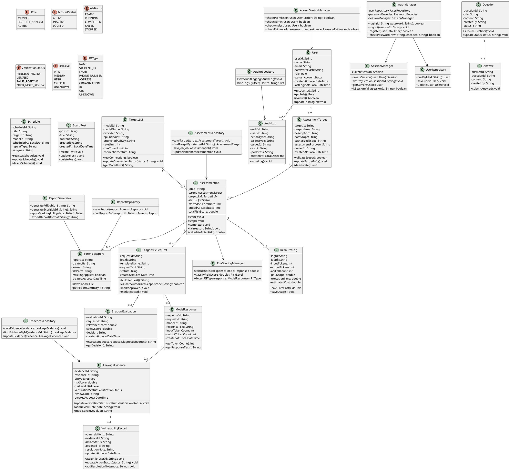

---

## 2.2 Class description

아래의 표는 위의 Class Diagram에서 표현한 클래스들에 대한 설명이다.

| Class Name | Explanation |
|---|---|
| **User** | Leakguard를 사용하는 모든 사용자의 정보를 저장하는 클래스이다. 사용자 ID, 이름, 이메일, 비밀번호 해시값, 권한, 계정 상태를 가진다. `getRole()` 메소드를 통해 현재 사용자의 권한을 확인하고, `isActive()` 메소드를 통해 계정 활성화 여부를 검사한다. |
| **AuthManager** | 로그인, 로그아웃, 회원가입을 처리하는 인증 관리 클래스이다. `login(id, password)` 메소드는 입력된 ID와 비밀번호를 검사하여 로그인 가능 여부를 반환한다. `register(userData)` 메소드는 신규 사용자 정보를 저장한다. |
| **SessionManager** | 로그인 후 사용자 세션을 관리하는 클래스이다. `createSession(user)` 메소드는 로그인 성공 시 세션을 생성하고, `destroySession(sessionId)` 메소드는 로그아웃 시 세션을 종료한다. |
| **AccessControlManager** | 사용자 권한을 검사하는 클래스이다. Member, Security Analyst, Admin의 권한을 구분하여 기능 접근 여부를 결정한다. Evidence 원문 조회나 Report 출력처럼 민감한 기능은 이 클래스를 통해 권한 확인 후 실행된다. |
| **AssessmentTarget** | 보안 진단 대상 정보를 저장하는 클래스이다. Target Name, Data Scope, Authorized Scope, Assessment Purpose 등을 가진다. `validateScope()` 메소드는 진단 범위가 승인된 범위 안에 있는지 검사한다. |
| **TargetLLM** | 진단 대상 LLM API 정보를 저장하는 클래스이다. 모델명, Provider, API Endpoint, 암호화된 API Key, Rate Limit, Max Token Limit 등을 가진다. `testConnection()` 메소드는 Target LLM API 연결 가능 여부를 확인한다. |
| **AssessmentJob** | 하나의 진단 실행 작업을 표현하는 클래스이다. 진단 대상, Target LLM, 실행 상태, 시작 시간, 종료 시간, 총 위험도 점수를 가진다. `start()`, `stop()`, `complete()`, `fail()` 메소드를 통해 진단 작업의 상태를 변경한다. |
| **DiagnosticRequest** | 진단 중 생성되는 개별 요청 단위이다. 요청 템플릿 이름, 요청 내용, 생성 시간, 실행 상태를 가진다. `validateAuthorizedScope()` 메소드는 요청이 승인된 진단 범위 안에 있는지 검사한다. |
| **ShadowEvaluation** | Shadow Model이 DiagnosticRequest를 사전 평가한 결과를 저장하는 클래스이다. 관련성 점수, 안전성 점수, 최종 decision 값을 가진다. decision 값은 Approved, Hold, Rejected 중 하나가 된다. |
| **ModelResponse** | Target LLM으로부터 반환된 응답을 저장하는 클래스이다. 응답 내용, 입력 토큰 수, 출력 토큰 수, 생성 시간을 가진다. |
| **RiskScoringManager** | 모델 응답의 개인정보 유출 위험도를 계산하는 클래스이다. `calculateRisk()` 메소드는 응답의 위험도 점수를 계산하고, `classifyRisk()` 메소드는 Low, Medium, High, Critical 등급으로 분류한다. |
| **LeakageEvidence** | 개인정보 유출 가능성이 있는 모델 응답을 Evidence 형태로 저장하는 클래스이다. PII 유형, 위험도 점수, 위험도 등급, 검증 상태, 분석가 검토 메모를 가진다. |
| **VulnerabilityRecord** | Verified 상태의 LeakageEvidence를 취약점 관리 대상으로 등록하는 클래스이다. 조치 상태, 담당자, 조치 메모를 저장한다. |
| **ResourceLog** | 진단 과정에서 사용된 API 호출 수, 입력 토큰 수, 출력 토큰 수, GPU 사용량, 실행 시간, 예상 비용을 기록하는 클래스이다. |
| **AuditLog** | 시스템의 주요 행위를 저장하는 클래스이다. 로그인, 권한 변경, 진단 실행, Evidence 검증, Report 출력 등의 이력을 저장한다. |
| **ReportGenerator** | 진단 결과를 PDF 또는 Excel 보고서로 생성하는 클래스이다. `generatePdf()`와 `generateExcel()` 메소드를 통해 Forensic Report 파일을 생성한다. |
| **ForensicReport** | 생성된 보고서의 메타데이터를 저장하는 클래스이다. 보고서 생성자, 파일 형식, 저장 경로, 마스킹 적용 여부, 생성 시간을 가진다. |
| **Schedule** | 정기 보안 점검 일정을 저장하는 클래스이다. 점검 대상, Target LLM, 점검 시간, 반복 여부, 담당자를 가진다. |
| **BoardPost** | 공지사항 게시글을 저장하는 클래스이다. 시스템 점검, 모델 업데이트, 진단 정책 변경 사항 등을 공지할 때 사용된다. |
| **Question** | 사용자가 작성한 질문을 저장하는 클래스이다. |
| **Answer** | Question에 대한 답변을 저장하는 클래스이다. |
| **UserRepository** | 사용자 정보를 데이터베이스에 저장하고 조회하는 클래스이다. |
| **AssessmentRepository** | AssessmentTarget과 AssessmentJob을 저장하고 조회하는 클래스이다. |
| **EvidenceRepository** | LeakageEvidence를 저장하고 조회하는 클래스이다. |
| **AuditRepository** | AuditLog를 저장하고 조회하는 클래스이다. |
| **ReportRepository** | ForensicReport 정보를 저장하고 조회하는 클래스이다. |

---

# 3. Sequence diagram

아래의 그림들은 Conceptualization과 Analysis에서 정의한 주요 기능들을 Sequence Diagram으로 표현한 것이다.

---

## 3.1 Login

아래의 그림은 시스템 실행 후 로그인 기능을 수행할 때의 Sequence Diagram이다. 사용자가 ID와 Password를 입력하면 `AuthManager`가 사용자 정보를 조회하고 비밀번호를 검사한다. 인증이 성공하면 `SessionManager`가 세션을 생성하고 Dashboard 화면으로 이동한다.

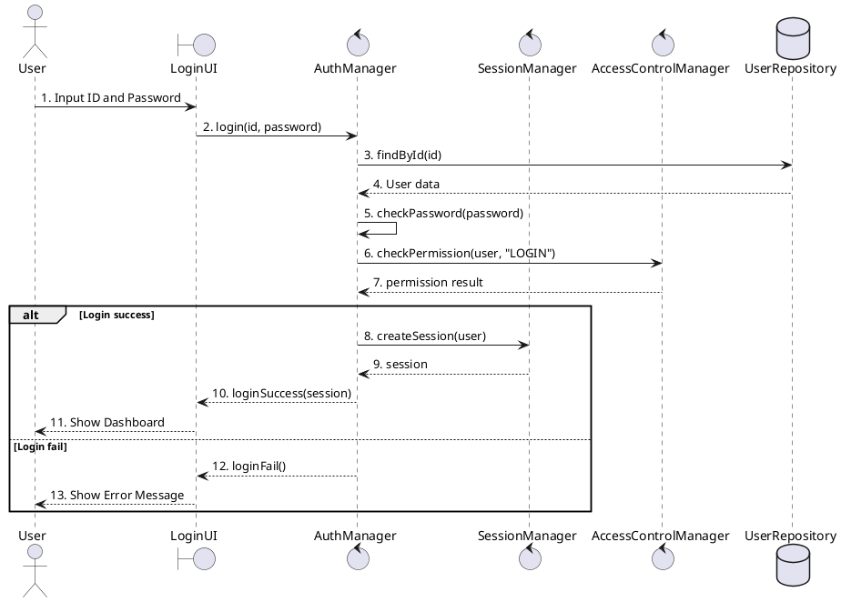

---

## 3.2 Register

아래의 그림은 회원가입 기능에 대한 Sequence Diagram이다. 사용자가 회원가입 정보를 입력하면 `AuthManager`가 중복 ID와 이메일 형식을 검사한 뒤 비밀번호를 해시 처리하고 사용자 정보를 저장한다.

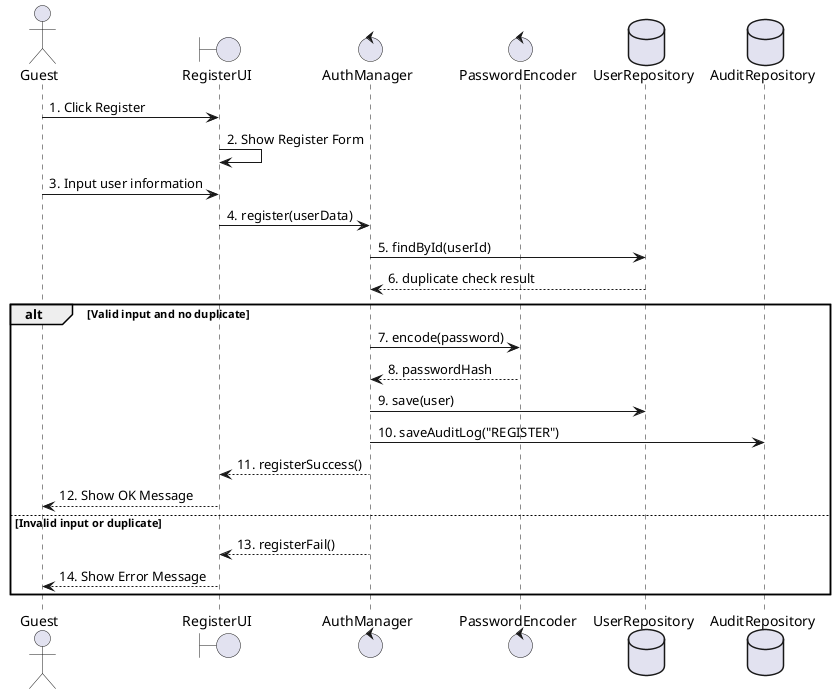

---

## 3.3 Register Assessment Target

아래의 그림은 보안 분석 담당자가 진단 대상을 등록할 때의 Sequence Diagram이다. 진단 대상은 Target Name, Data Scope, Authorized Scope, Assessment Purpose를 포함한다.

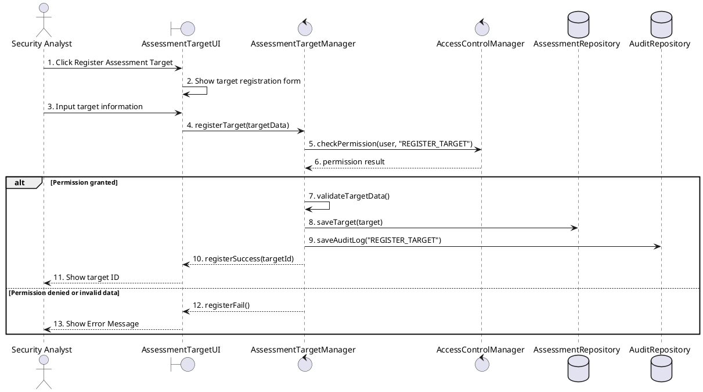

---

## 3.4 Execute Adaptive Assessment

아래의 그림은 Leakguard의 핵심 기능인 Adaptive Assessment 실행에 대한 Sequence Diagram이다. Security Analyst가 진단을 시작하면 시스템은 권한을 확인하고, Shadow Pre-Critique를 수행한 뒤 승인된 요청만 Target LLM에 전송한다. 모델 응답은 위험도 계산 후 Evidence Candidate로 저장된다.

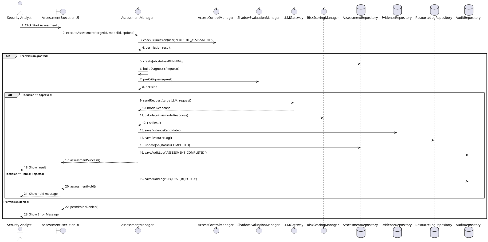

---

## 3.5 Shadow Pre-Critique

아래의 그림은 Shadow Pre-Critique에 대한 Sequence Diagram이다. 이 과정은 Target LLM 호출 전에 진단 요청의 관련성, 안전성, 평가 가능성을 점검한다.

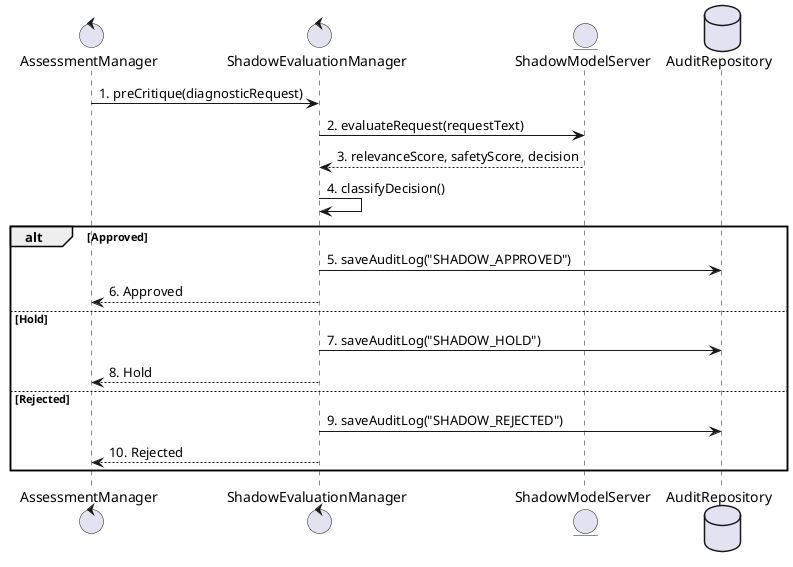

---

## 3.6 Verify Leakage Evidence

아래의 그림은 보안 분석 담당자가 유출 후보를 검증하는 기능에 대한 Sequence Diagram이다. Pending Review 상태의 Evidence를 확인한 뒤 Verified, False Positive, Need More Review 중 하나로 상태를 변경한다.

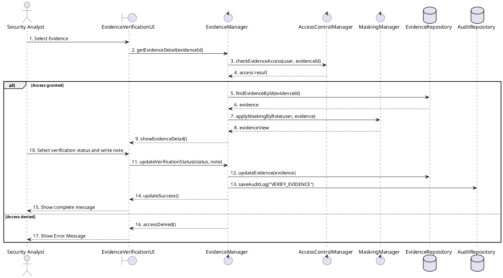

---

## 3.7 Resource & Token Audit

아래의 그림은 자원 및 토큰 사용량 조회 기능에 대한 Sequence Diagram이다. 사용자가 기간과 모델을 선택하면 시스템은 해당 조건에 맞는 Resource Log를 조회하고 통계를 계산한다.

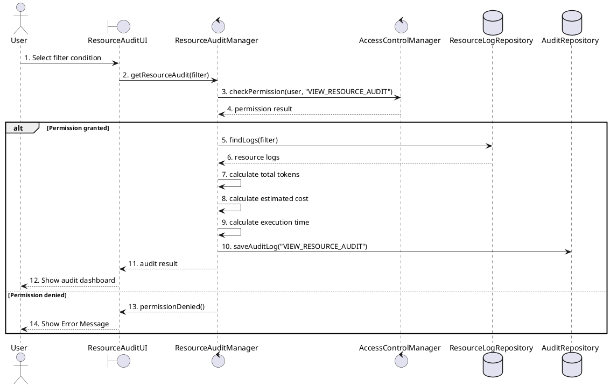

---

## 3.8 Export Forensic Report

아래의 그림은 Forensic Report 출력 기능에 대한 Sequence Diagram이다. 사용자가 출력 조건을 선택하면 시스템은 진단 결과, Evidence, Audit Log, Resource Log를 모아 PDF 또는 Excel 파일을 생성한다.

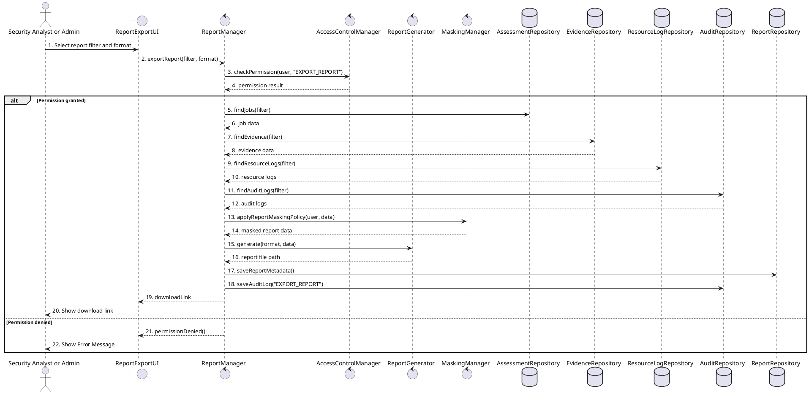

---

## 3.9 Strategic Schedule Planning

아래의 그림은 정기 점검 일정 등록 기능에 대한 Sequence Diagram이다. 관리자가 진단 대상, 모델, 담당자, 점검 시간을 입력하면 시스템은 일정 충돌 여부를 확인한 뒤 일정을 저장한다.

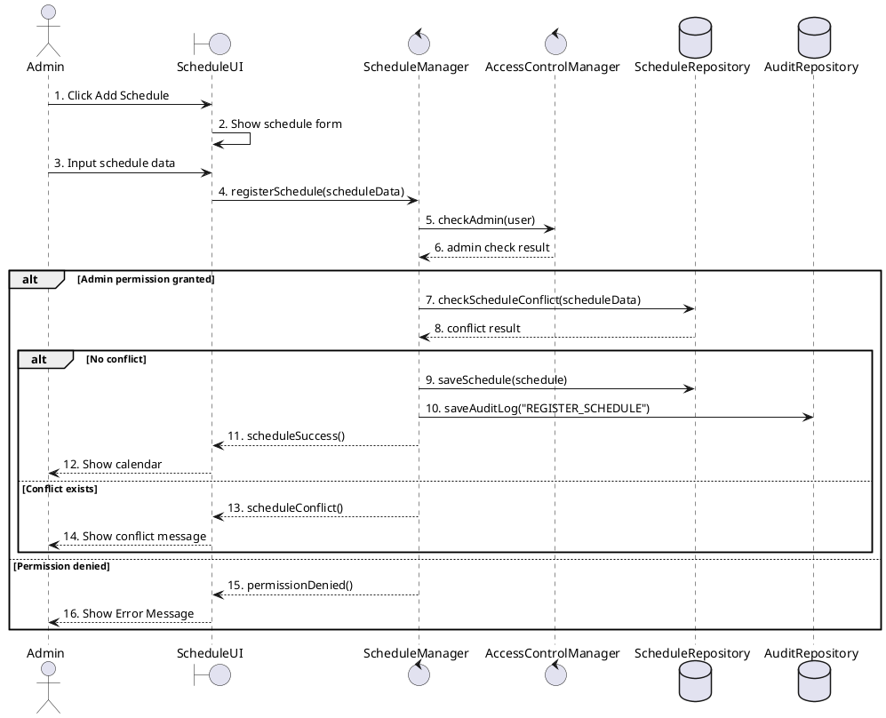

---

# 4. State machine diagram

## 4.1 State machine diagram

아래의 그림은 Leakguard 시스템의 State Machine Diagram을 PlantUML 형식으로 표현한 것이다.

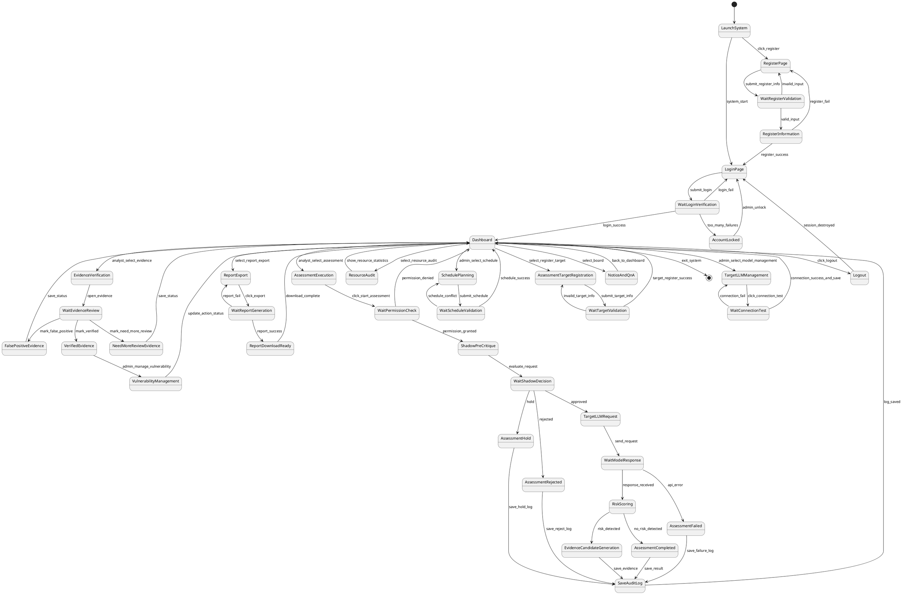

---

## 4.2 State description

아래는 State Machine Diagram에 나온 각 State에 대한 설명이다.

| State | Explanation |
|---|---|
| **LaunchSystem** | Leakguard 시스템이 실행된 상태이다. 사용자는 로그인 또는 회원가입을 선택할 수 있다. |
| **LoginPage** | 사용자가 ID와 Password를 입력하여 로그인하는 상태이다. |
| **RegisterPage** | 신규 사용자가 회원가입 정보를 입력하는 상태이다. |
| **WaitRegisterValidation** | 회원가입 입력값의 형식, 중복 ID, 이메일 형식 등을 검사하는 상태이다. |
| **RegisterInformation** | 회원가입 정보가 검증된 후 사용자 정보를 데이터베이스에 저장하는 상태이다. |
| **WaitLoginVerification** | 로그인 정보가 올바른지 확인하는 상태이다. |
| **AccountLocked** | 로그인 실패 횟수가 기준을 넘어서 계정이 잠긴 상태이다. |
| **Dashboard** | 로그인 성공 후 사용자가 시스템의 주요 기능을 선택할 수 있는 상태이다. |
| **AssessmentTargetRegistration** | 보안 분석 담당자가 진단 대상 정보를 입력하는 상태이다. |
| **WaitTargetValidation** | 진단 대상 정보가 올바른지, 승인된 진단 범위가 포함되어 있는지 검사하는 상태이다. |
| **TargetLLMManagement** | 관리자가 Target LLM API 정보를 등록하거나 수정하는 상태이다. |
| **WaitConnectionTest** | Target LLM API 연결 테스트 결과를 기다리는 상태이다. |
| **AssessmentExecution** | 보안 분석 담당자가 진단 실행 조건을 설정하는 상태이다. |
| **WaitPermissionCheck** | 사용자가 진단 실행 권한을 가지고 있는지 검사하는 상태이다. |
| **ShadowPreCritique** | Target LLM 호출 전 Shadow Model을 이용해 요청을 사전 평가하는 상태이다. |
| **WaitShadowDecision** | Shadow Model의 평가 결과를 기다리는 상태이다. |
| **AssessmentHold** | Shadow Model 결과가 보류로 분류되어 Target LLM 호출을 하지 않는 상태이다. |
| **AssessmentRejected** | Shadow Model 결과가 거절로 분류되어 진단 요청을 폐기하는 상태이다. |
| **TargetLLMRequest** | 승인된 진단 요청을 Target LLM API로 전송하는 상태이다. |
| **WaitModelResponse** | Target LLM 응답을 기다리는 상태이다. |
| **RiskScoring** | Target LLM 응답의 개인정보 유출 위험도를 계산하는 상태이다. |
| **EvidenceCandidateGeneration** | 위험도가 있는 응답을 Evidence Candidate로 저장하는 상태이다. |
| **AssessmentCompleted** | 진단 작업이 정상적으로 완료된 상태이다. |
| **AssessmentFailed** | API 오류, 네트워크 장애, 저장 실패 등으로 진단 작업이 실패한 상태이다. |
| **SaveAuditLog** | 진단 실행 결과, 실패 원인, Evidence 저장 이력 등을 Audit Log로 저장하는 상태이다. |
| **EvidenceVerification** | 보안 분석 담당자가 유출 후보를 검토하는 상태이다. |
| **WaitEvidenceReview** | 분석 담당자가 검증 상태와 검토 메모를 입력하는 상태이다. |
| **VerifiedEvidence** | 유출 후보가 실제 유출 가능성이 있는 증거로 검증된 상태이다. |
| **FalsePositiveEvidence** | 유출 후보가 검토 결과 오탐으로 판단된 상태이다. |
| **NeedMoreReviewEvidence** | 추가 검토가 필요한 상태이다. |
| **VulnerabilityManagement** | 관리자가 Verified Evidence를 취약점 관리 대상으로 등록하고 조치 상태를 관리하는 상태이다. |
| **ResourceAudit** | 사용자가 API 토큰, GPU, 실행 시간, 예상 비용을 조회하는 상태이다. |
| **ReportExport** | 사용자가 Forensic Report 출력 조건을 선택하는 상태이다. |
| **WaitReportGeneration** | PDF 또는 Excel 보고서 생성이 완료되기를 기다리는 상태이다. |
| **ReportDownloadReady** | 보고서 생성이 완료되어 다운로드 가능한 상태이다. |
| **SchedulePlanning** | 관리자가 정기 점검 일정을 등록하는 상태이다. |
| **WaitScheduleValidation** | 일정 충돌 여부와 입력값 유효성을 검사하는 상태이다. |
| **NoticeAndQnA** | 사용자가 공지사항을 확인하거나 질문·답변을 작성하는 상태이다. |
| **Logout** | 사용자가 로그아웃하여 세션을 종료하는 상태이다. |

---

# 5. Implementation requirements

Leakguard 시스템을 구현하기 위해 필요한 요구사항은 아래와 같다.

---

## 5.1 Hardware requirements

| Item | Minimum Requirement | Recommended Requirement |
|---|---|---|
| CPU | Intel i5 이상 또는 동급 AMD CPU | Intel i7 이상 또는 Apple Silicon M-series |
| RAM | 8GB 이상 | 16GB 이상 |
| Storage | 10GB 이상의 여유 공간 | 30GB 이상의 여유 공간 |
| GPU | 필수 아님 | Shadow Model 로컬 실행 시 NVIDIA GPU 8GB VRAM 이상 |
| Network | Target LLM API 사용 시 인터넷 연결 필요 | 안정적인 유선 또는 고속 무선 네트워크 |
| Display | 1366x768 이상 | 1920x1080 이상 |

---

## 5.2 Software requirements

| Item | Requirement |
|---|---|
| Operating System | Windows 10 이상, Ubuntu 20.04 이상, macOS 13 이상 |
| Implementation Language | Python 3.10 이상 |
| GUI Framework | PyQt5 또는 PySide6 |
| Backend Framework | FastAPI 또는 Flask |
| Database | SQLite, PostgreSQL 중 하나 |
| ORM | SQLAlchemy |
| LLM API Client | OpenAI API, Local LLM API, HuggingFace Inference API 등과 연결 가능한 구조 |
| Report Library | ReportLab, openpyxl, pandas |
| Security Library | bcrypt, cryptography |
| Diagram Tool | PlantUML |
| Version Control | Git, GitHub |

---

## 5.3 Nonfunctional requirements

| Requirement | Explanation |
|---|---|
| **Performance** | 로그인, 회원가입, 단순 조회는 1초 이내에 처리되어야 한다. 대시보드 조회는 3초 이내에 완료되어야 한다. |
| **Reliability** | Target LLM API 호출 실패, 네트워크 장애, 저장 실패가 발생해도 실패 로그가 저장되어야 한다. |
| **Security** | 비밀번호, API Key, Evidence 원문은 암호화하거나 해시 처리해야 한다. |
| **Privacy** | 사용자 권한에 따라 Evidence 원문과 PII 후보 값은 마스킹되어야 한다. |
| **Auditability** | 로그인, 권한 변경, 진단 실행, Evidence 검증, Report 출력은 Audit Log로 저장되어야 한다. |
| **Usability** | 보안 비전문가도 위험도를 이해할 수 있도록 Dashboard에 그래프와 상태 요약을 제공해야 한다. |
| **Maintainability** | Target LLM API, Shadow Model, Report Generator는 독립 모듈로 구성하여 교체 가능해야 한다. |
| **Portability** | Windows와 Linux 환경에서 실행 가능해야 한다. |
| **Scalability** | 진단 대상 모델과 사용자 수가 증가해도 Repository와 Service 구조를 유지하면서 확장 가능해야 한다. |

---

## 5.4 Data storage requirements

Leakguard는 민감한 진단 데이터를 다루기 때문에 데이터 저장 정책이 중요하다.

| Data | Storage Method | Explanation |
|---|---|---|
| User password | Hash | 평문 저장 금지. bcrypt 또는 PBKDF2 사용 |
| API Key | Encryption | cryptography 기반 암호화 저장 |
| Assessment Target | Database | 진단 대상 이름, 범위, 목적 저장 |
| Diagnostic Request | Database | 요청 원문 또는 요청 템플릿 저장 |
| Model Response | Encrypted Database | Target LLM 응답은 민감 가능성이 있으므로 암호화 저장 |
| Leakage Evidence | Encrypted Database | 유출 후보와 검증 상태 저장 |
| Resource Log | Database | 토큰 수, API 호출 수, GPU 사용량, 비용 저장 |
| Audit Log | Append-only Database | 주요 행위 이력 저장. 일반 사용자 삭제 불가 |
| Forensic Report | File System + Metadata DB | PDF, Excel 파일 경로와 생성 이력 저장 |
| Schedule | Database | 정기 점검 일정 저장 |
| Board / Q&A | Database | 공지사항, 질문, 답변 저장 |

---

## 5.5 Security requirements

| Security Item | Requirement |
|---|---|
| Authentication | 모든 사용자는 로그인 후 시스템을 사용할 수 있어야 한다. |
| Authorization | Member, Security Analyst, Admin 권한을 구분해야 한다. |
| Password Protection | 비밀번호는 해시값으로 저장한다. |
| API Key Protection | Target LLM API Key는 암호화 저장한다. |
| Evidence Access Control | Evidence 원문은 Security Analyst 이상만 접근 가능하다. |
| Report Masking | Report 출력 시 사용자 권한에 따라 민감 정보를 마스킹한다. |
| Audit Log Protection | Audit Log는 관리자만 조회할 수 있으며 일반 사용자는 수정할 수 없다. |
| Scope Validation | Authorized Scope 밖의 진단 요청은 실행하지 않는다. |
| Shadow Filtering | Shadow Pre-Critique 결과가 Rejected인 요청은 Target LLM으로 전송하지 않는다. |
| Rate Limit | Target LLM API 호출 수 제한을 적용한다. |

---

# 6. Glossary

| Terms | Description |
|---|---|
| **Class Diagram** | 객체지향 시스템 설계에서 클래스들의 구조, 속성, 메소드, 관계를 표현하는 UML 다이어그램이다. |
| **Sequence Diagram** | 객체 또는 클래스 사이에서 시간 순서에 따라 메시지가 어떻게 전달되는지 표현하는 UML 다이어그램이다. |
| **State Machine Diagram** | 시스템이 가질 수 있는 상태와 상태 간 전이를 표현하는 UML 다이어그램이다. |
| **LLM** | Large Language Model의 약자이며, 대규모 텍스트 데이터를 기반으로 학습된 언어 모델이다. |
| **PII** | Personal Identifiable Information의 약자이며, 이름, 학번, 이메일, 전화번호, 주소 등 개인을 식별할 수 있는 정보이다. |
| **Leakguard** | LLM의 개인정보 유출 가능성을 진단하고 이력을 관리하는 보안 분석 시스템이다. |
| **Target LLM** | Leakguard가 진단 대상으로 삼는 외부 또는 내부 LLM이다. |
| **Shadow Model** | Target LLM 호출 전 진단 요청의 유효성을 사전 평가하는 보조 모델이다. |
| **Shadow Pre-Critique** | Shadow Model을 이용해 진단 요청을 사전에 평가하고 Approved, Hold, Rejected로 분류하는 과정이다. |
| **Adaptive Assessment** | 진단 대상, 승인 범위, Shadow 평가 결과에 따라 Target LLM에 보안 진단 요청을 보내는 과정이다. |
| **Diagnostic Request** | 진단 과정에서 생성되는 개별 요청 단위이다. |
| **Model Response** | Target LLM이 Diagnostic Request에 대해 반환한 응답이다. |
| **Risk Score** | 모델 응답의 개인정보 유출 위험도를 수치화한 값이다. |
| **Risk Level** | Risk Score를 Low, Medium, High, Critical 등급으로 구분한 값이다. |
| **Leakage Evidence** | 개인정보 유출 가능성이 있는 모델 응답 또는 검증된 유출 증거이다. |
| **Evidence Candidate** | 아직 분석 담당자가 검증하지 않은 유출 후보 데이터이다. |
| **Verified Evidence** | 보안 분석 담당자가 실제 유출 가능성이 있다고 검증한 Evidence이다. |
| **False Positive** | 유출처럼 보였지만 검토 결과 실제 유출이 아닌 데이터이다. |
| **Need More Review** | 추가 검토가 필요한 Evidence 상태이다. |
| **Vulnerability Record** | Verified Evidence를 취약점 관리 대상으로 등록한 데이터이다. |
| **Resource Log** | API 호출 수, 입력 토큰 수, 출력 토큰 수, GPU 사용량, 예상 비용 등을 기록한 로그이다. |
| **Audit Log** | 사용자 행위와 시스템 변경 이력을 저장하는 로그이다. |
| **Forensic Report** | 진단 결과, Evidence, Audit Log, Resource Log를 정리한 PDF 또는 Excel 보고서이다. |
| **Masking** | 민감 정보의 일부를 가려서 표시하는 처리 방식이다. |
| **Access Control** | 사용자 권한에 따라 접근 가능한 기능과 데이터를 제한하는 방식이다. |
| **Authorized Scope** | 보안 진단이 허용된 모델, 데이터, 요청 범위이다. |
| **API Rate Limit** | 외부 API 호출 횟수를 제한하는 정책이다. |
| **Repository** | 데이터베이스에 객체를 저장하고 조회하는 클래스 계층이다. |

---

# 7. References

1. Yao, Y., Zhang, X., et al. “A Survey on Large Language Model Security and Privacy.” *Patterns*, 2024.  
2. Cheng, S., Li, Y., et al. “Understanding PII Leakage in Large Language Models.” *IJCAI*, 2025.  
3. “Evaluating Privacy Leakage and Memorization Attacks on Large Language Models.” *Scientific Research Publishing*, 2024.  
4. “Sensitive Data Extraction from Black Box Large Language Models: Attack Vectors and Defenses.” *TechRxiv preprint*, 2024.  
5. Lu, X., et al. “Do LLMs Really Memorize Personally Identifiable Information?” *arXiv*, 2026.  
6. “Membership Inference Attacks on Tokenizers of Large Language Models.” *arXiv*, 2025.  
7. “Membership Inference Attack Against Large Language Models.” *arXiv*, 2025.  
8. Yin, L., et al. “LeakGuard: Detecting Memory Leaks Accurately and Scalably.” *arXiv*, 2025.  
9. SPARX SYSTEMS. “State Machine Diagram Practice.”  
10. PlantUML Documentation. “Class Diagram, Sequence Diagram, State Diagram Syntax.”  